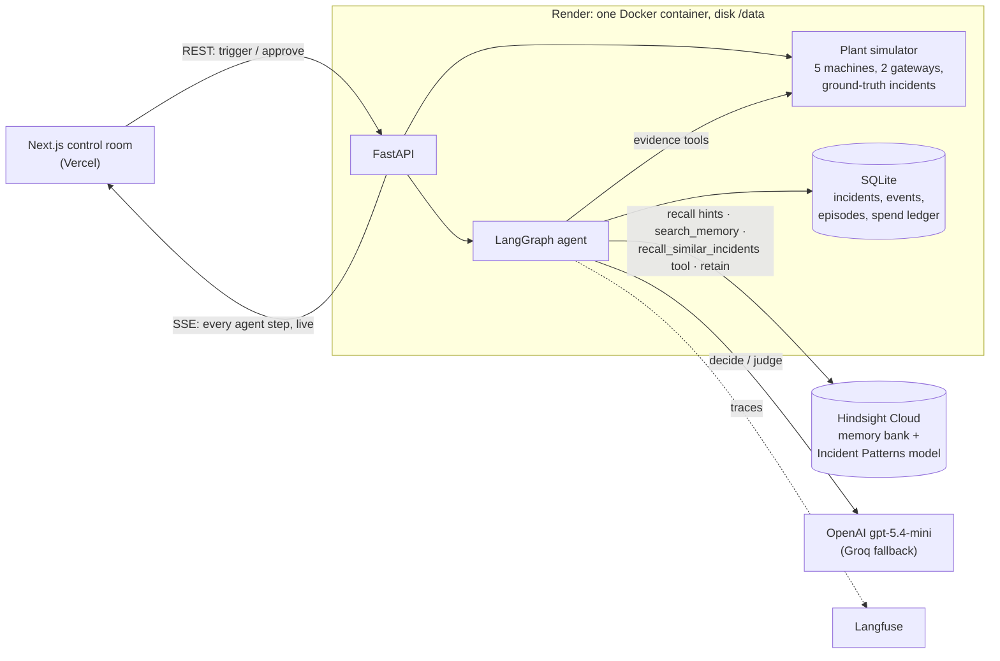
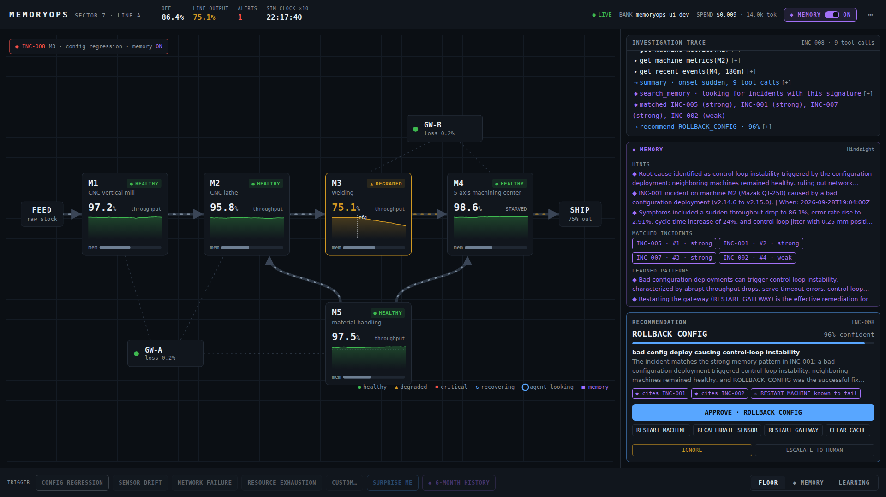
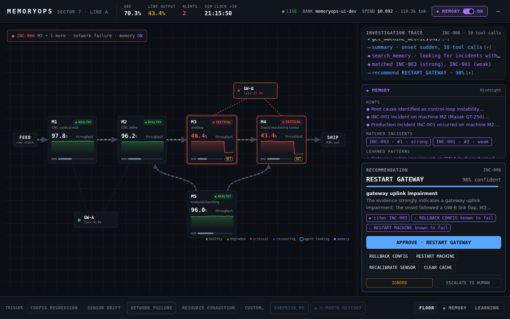
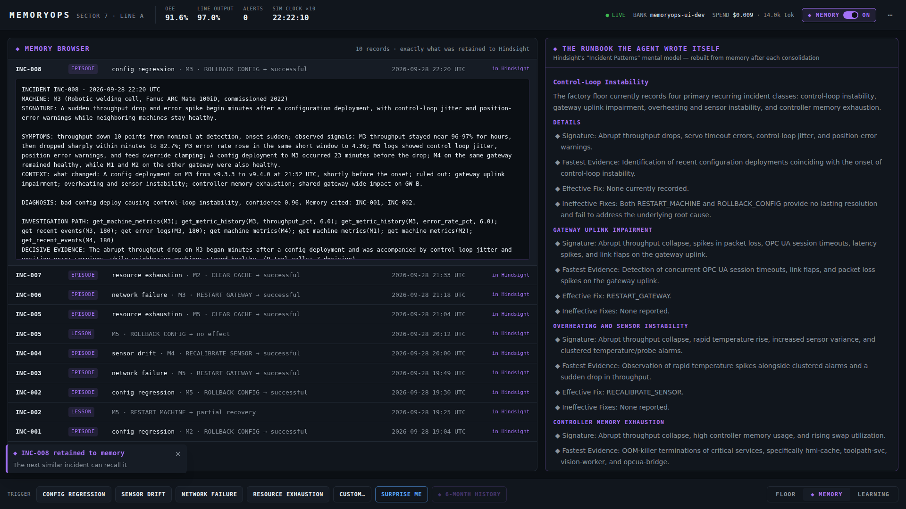
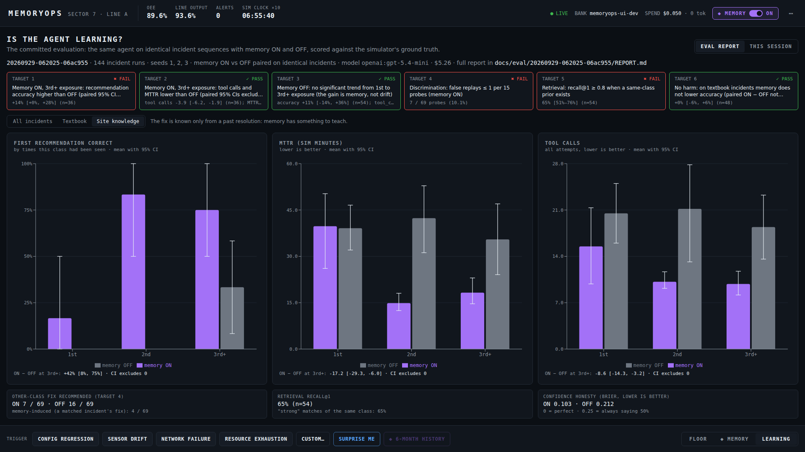

# MemoryOps

[](https://github.com/sanithvarma0/memoryops/actions/workflows/ci.yml)

**A self-learning production incident commander.** A simulated 5-machine factory develops incidents. A single LangGraph agent investigates them with real tools, recommends a fix, and waits for a human to approve it. Every resolution is retained in [Hindsight](https://hindsight.vectorize.io) memory, so the next incident of the same kind is diagnosed faster and fixed right the first time. That includes incidents whose fix *cannot* be read off the signals and is known only to the plant's engineers.

**Live demo: https://memoryops.vercel.app** (API: https://memoryops-api.onrender.com/docs). The demo is public and needs no login. Click **VISION DROPOUT** or **SERVO DRIFT** under **◆ SITE** and watch the agent cite a past incident. See [docs/DEMO.md](docs/DEMO.md) for the walkthrough.

## Results (paired memory ON vs OFF, 144 live incident runs)

The same agent ran identical incident sequences with memory ON and memory OFF, over 3 seeds and 24 incidents each. It was scored against the simulator's ground truth. Full report: [`docs/eval/20260929-062025-06ac955/REPORT.md`](docs/eval/20260929-062025-06ac955/REPORT.md).

| Incident family | First recommendation correct (ON − OFF) | Tool calls (ON − OFF) | Time to recover (ON − OFF) |
|---|---|---|---|
| **Site knowledge**: the fix is known only from a past resolution | **+46 pts** [+25, +67] | **−8.3** [−12.0, −4.7] | **−15.3 sim-min** [−23.6, −7.1] |
| **Textbook**: the fix follows from the evidence | +0 pts [−6, +6] (no harm) | −0.9 [−1.6, −0.1] | −0.4 sim-min [−2.3, +2.0] |

Brackets are paired 95% bootstrap CIs.

On site-knowledge incidents seen before, memory ON recommends the right fix 75–83% of the time, against 0–33% with memory OFF.

**Acceptance targets: 3 of 6 pass.** These 3 are reported with their causes rather than tuned away:
- **Target 1** (accuracy at the 3rd+ exposure, all incidents): +14% [+0, +28]. The CI touches 0.
- **Target 4** (false replays): 7 of 69 probes.
- **Target 5** (retrieval recall@1): 65%. This run was gated by an LLM judge because Hindsight Cloud's reranker was in passthrough mode (BUILD_PLAN 6.3b).

Totals: 280 backend and 17 frontend tests; CI runs the same eval pipeline with a fake LLM and fake memory.

## Architecture



This is the agent loop for each incident:
1. `detect`
2. `recall_hints` (memory)
3. `investigate` (tool calls, plus a mid-investigation memory lookup)
4. `search_memory`
5. `decide`
6. the human approves
7. `act`
8. `verify`: on a bad fix, record a lesson and retry; on success or escalation, retain the episode

## Prerequisites

- Python 3.11+ and [uv](https://docs.astral.sh/uv/)
- Node.js 20+
- API keys: Hindsight Cloud, OpenAI (primary LLM), Groq (fallback LLM), Langfuse (see `.env.example`)

## Setup

```bash
cp .env.example .env        # fill in your keys
uv sync                     # backend deps
cd frontend && npm install  # frontend deps
```

## The control room



| Network failure (1440×900) | Memory Browser + self-written runbook | Learning |
|---|---|---|
|  |  |  |

Screenshots from a real session against live services (BUILD_PLAN.md 14.1e) — including the incident where memory misled the agent.

## Evaluation

```bash
make eval-quick   # 1 seed x 18 incidents x memory ON/OFF, ~15 min, ~$1.5
make eval         # 3 seeds x 24 incidents x memory ON/OFF, ~45 min, ~$5 (LLM + Hindsight)
```

Each run writes `docs/eval/<date>-<sha>/REPORT.md` (targets PASS/FAIL, learning by exposure with 95% CIs, per family and class, transfer, discrimination, retrieval, calibration, cost, every failure with a Langfuse trace link), `results.json` and charts. The Learning tab shows the latest. CI runs the same pipeline with a fake LLM and fake memory.

## Run

```bash
# backend (http://localhost:8000)
uv run uvicorn backend.main:app --reload

# frontend — the control room (http://localhost:3000)
cd frontend && npm run dev

# or both at once
make dev
```

Check `http://localhost:8000/api/health` — every dependency should report `ok`.

Drive an incident from the terminal (the UI does the same over the same API):

```bash
curl -N localhost:8000/api/stream &                                   # live events
curl -XPOST localhost:8000/api/incident/predefined \
     -H 'content-type: application/json' -d '{"type":"config_regression","machine":"M3"}'
curl localhost:8000/api/incidents/INC-001                             # pending recommendation
curl -XPOST localhost:8000/api/incident/INC-001/action \
     -H 'content-type: application/json' -d '{"action":"ROLLBACK_CONFIG"}'
curl localhost:8000/api/usage                                         # tokens + spend
```

API reference: `http://localhost:8000/docs`.

## Deploy

The backend runs on Render (Docker, persistent disk, `render.yaml`) and the UI on Vercel (root `frontend`). The public demo has no passcode. Spend is capped by an incident rate limit (40 per hour) and the LLM spend cap. An optional `DEMO_PASSCODE` locks all actions. Local fallback: `docker compose up --build`. Full steps in [docs/DEPLOY.md](docs/DEPLOY.md).

## Phase 0.5 spikes

```bash
uv run python scripts/spike_hindsight.py   # recall scores, retain latency, observation lag
uv run python scripts/spike_groq.py        # models, tool calling, malformed-call errors
uv run python scripts/spike_recall_design.py sig   # record/query design vs match separation
```

## Live dry run (agent end to end on Groq + Hindsight + Langfuse)

```bash
uv run python scripts/demo_dryrun.py   # 6-incident demo storyline on a throwaway memory bank
uv run python scripts/seed_demo.py --base https://memoryops-api.onrender.com   # real history for the demo bank
make usage                               # LLM spend + tokens: all-time, by model, by step, per run
```

Every LLM call is recorded (tokens, cost, latency, incident) in `data/usage.db`; LLM calls stop at `LLM_SPEND_CAP_USD` (default $10) and the agent escalates instead.

## Tests

```bash
make check      # ruff + format check + eslint + mypy --strict + pytest (what CI runs)
make test       # pytest only — no network, no API keys
```

## How Hindsight memory is used

Hindsight is the agent's only long-term memory. Nothing about past incidents is hard-coded or kept in the prompt. The full spec is in BUILD_PLAN.md Section 6; the code is in `backend/memory/`.

| Hindsight feature | What MemoryOps does with it |
|---|---|
| **Bank** with `mission`, `retain_mission`, `observations_mission` | There is one bank per deployment (`memoryops-demo`) plus throwaway banks for each eval condition and seed. The missions tell Hindsight to extract symptoms, decisive evidence, what worked or failed, and time to recover, and to ignore IDs and exact numbers. |
| **`retain`** (episodes) | Every closed incident is written as a prose episode. It contains: a generalized **signature**, symptoms, context, the agent's diagnosis, each action tried and its effect, the investigation path, the **decisive evidence**, the outcome and a one-line lesson. On escalation it also carries the **on-call engineer's note**, which is the only place site knowledge exists. `document_id` = the incident ID (idempotent), and metadata carries the diagnosis, final action, signature and decisive evidence. |
| **`retain`** (lessons) | When a fix fails partway through an incident, a lesson is retained immediately (`kind:lesson`), so learning from failure survives even if the incident is never finished. |
| **`recall`**, touchpoint 1: hints | Runs before investigating. The query is built from the alert only, paraphrased (no IDs or numbers). It tells the agent which evidence was decisive last time, which means fewer tool calls. |
| **`recall`**, touchpoint 2: signature match | Runs after investigating. The query is built from the observed evidence. Candidates are grouped per past incident and gated. The gate uses the cross-encoder reranker score when Hindsight returns one; otherwise an LLM judge rates the top 5 against the trigger and the identifying evidence. Matched incidents, their fixes and actions known to fail go to `decide`, which must cite what it used. |
| **`recall_similar_incidents` tool** | The agent can also ask memory mid-investigation, as a tool call. It is offered only when memory is ON. |
| **Mental model** "Incident Patterns" | Hindsight keeps rewriting it in the background as observations consolidate. It is shown in the UI as *the runbook the agent wrote itself*, and it is injected into the hints step. |
| **Memory toggle** | With memory OFF, recall and the tool are removed entirely, but retain still happens. That is what makes the paired ON vs OFF evaluation fair. |

Every write goes to SQLite first (`pending`), then to Hindsight, with a retry loop. A Hindsight outage shows up as an error event and never breaks an incident.

Every Hindsight call's billed tokens are estimated and ledgered next to the LLM spend (`/api/usage`, and the SPEND display in the top bar).
