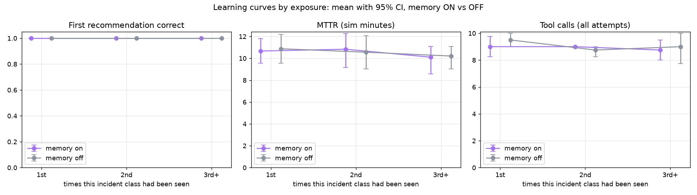
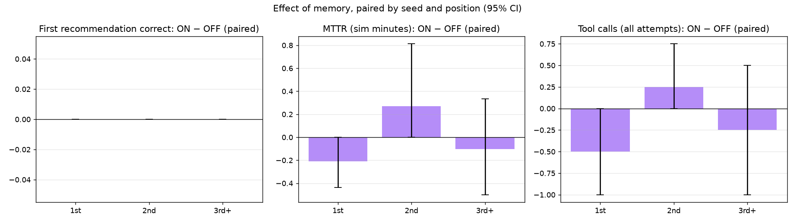
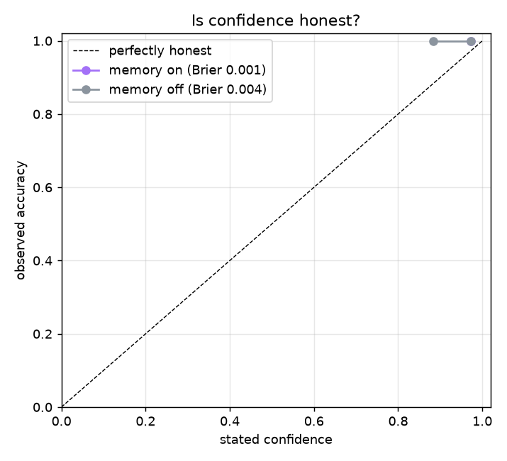

# MemoryOps evaluation — 20260928-193803-c380d38-quick

24 incident runs · seeds [1] · memory ON vs OFF, paired (same incidents, same order) · auto-approval · fast-forward clock (35 sim-s per tool call) · git `c380d38` (dirty tree) · model `openai:gpt-5.4-mini` · 2026-09-28T19:38:03+00:00

## Acceptance targets (BUILD_PLAN 11.5)

| # | Target | Result | Evidence |
|---|---|---|---|
| 1 | Memory ON, 3rd+ exposure: recommendation accuracy higher than OFF (paired 95% CI excludes 0) | ❌ FAIL | +0% [+0%, +0%] (n=4) |
| 2 | Memory ON, 3rd+ exposure: tool calls and MTTR lower than OFF (paired 95% CIs exclude 0) | ❌ FAIL | tool calls -0.2 [-1.0, +0.5] (n=4); MTTR -0.1 min [-0.5, +0.3] (n=4) |
| 3 | Memory OFF: no significant trend from 1st to 3rd+ exposure (the gain is memory, not drift) | ✅ PASS | accuracy +0% [+0%, +0%] (n=8); tool_calls -0.5 [-2.0, +0.8] (n=8) |
| 4 | Discrimination: false replays ≤ 1 per 15 probes (memory ON) | ✅ PASS | 0 / 11 probes (0.0%) |
| 5 | Retrieval: recall@1 ≥ 0.8 when a same-class prior exists | ✅ PASS | 100% [68%–100%] (n=8) |

If a target is missed, the fix belongs in the agent or memory design — never in the metric.

## Learning by exposure

Mean [95% bootstrap CI]; ON − OFF is paired by (seed, position).

**First recommendation correct**

| Exposure | Memory ON | Memory OFF | ON − OFF (paired) |
|---|---|---|---|
| 1st | 100% [100%–100%] n=4 | 100% [100%–100%] n=4 | +0% [+0%, +0%] (n=4) |
| 2nd | 100% [100%–100%] n=4 | 100% [100%–100%] n=4 | +0% [+0%, +0%] (n=4) |
| 3rd+ | 100% [100%–100%] n=4 | 100% [100%–100%] n=4 | +0% [+0%, +0%] (n=4) |

**MTTR (sim minutes)**

| Exposure | Memory ON | Memory OFF | ON − OFF (paired) |
|---|---|---|---|
| 1st | 10.7 [9.5–11.8] n=4 | 10.9 [9.5–12.2] n=4 | -0.2 min [-0.4, +0.0] (n=4) |
| 2nd | 10.8 [9.2–12.2] n=4 | 10.6 [9.0–12.1] n=4 | +0.3 min [+0.0, +0.8] (n=4) |
| 3rd+ | 10.1 [8.6–11.1] n=4 | 10.2 [9.0–11.1] n=4 | -0.1 min [-0.5, +0.3] (n=4) |

**Tool calls (all attempts)**

| Exposure | Memory ON | Memory OFF | ON − OFF (paired) |
|---|---|---|---|
| 1st | 9.0 [8.2–9.8] n=4 | 9.5 [9.0–10.0] n=4 | -0.5 [-1.0, +0.0] (n=4) |
| 2nd | 9.0 [9.0–9.0] n=4 | 8.8 [8.2–9.0] n=4 | +0.2 [+0.0, +0.8] (n=4) |
| 3rd+ | 8.8 [8.0–9.5] n=4 | 9.0 [7.8–10.0] n=4 | -0.2 [-1.0, +0.5] (n=4) |

**Stated confidence**

| Exposure | Memory ON | Memory OFF | ON − OFF (paired) |
|---|---|---|---|
| 1st | 96% [96%–98%] n=4 | 94% [89%–98%] n=4 | +2% [-1%, +7%] (n=4) |
| 2nd | 98% [97%–98%] n=4 | 94% [89%–98%] n=4 | +3% [+0%, +8%] (n=4) |
| 3rd+ | 98% [96%–98%] n=4 | 96% [94%–98%] n=4 | +1% [+0%, +2%] (n=4) |





### What drives MTTR

| Exposure | Condition | Attempts (mean) | Wrong first fix | Escalated | n |
|---|---|---|---|---|---|
| 1st | memory_on | 1.00 | 0 | 0 | 4 |
| 1st | memory_off | 1.00 | 0 | 0 | 4 |
| 2nd | memory_on | 1.00 | 0 | 0 | 4 |
| 2nd | memory_off | 1.00 | 0 | 0 | 4 |
| 3rd+ | memory_on | 1.00 | 0 | 0 | 4 |
| 3rd+ | memory_off | 1.00 | 0 | 0 | 4 |

## Per class

| Class | Exposure | Accuracy ON | Accuracy OFF | MTTR ON | MTTR OFF | Tools ON | Tools OFF |
|---|---|---|---|---|---|---|---|
| config regression | 1st | 100% [100%–100%] n=1 | 100% [100%–100%] n=1 | 10.1 [10.1–10.1] n=1 | 10.1 [10.1–10.1] n=1 | 9.0 [9.0–9.0] n=1 | 9.0 [9.0–9.0] n=1 |
| config regression | 2nd | 100% [100%–100%] n=1 | 100% [100%–100%] n=1 | 11.4 [11.4–11.4] n=1 | 11.4 [11.4–11.4] n=1 | 9.0 [9.0–9.0] n=1 | 9.0 [9.0–9.0] n=1 |
| config regression | 3rd+ | 100% [100%–100%] n=1 | 100% [100%–100%] n=1 | 10.4 [10.4–10.4] n=1 | 10.8 [10.8–10.8] n=1 | 9.0 [9.0–9.0] n=1 | 10.0 [10.0–10.0] n=1 |
| sensor drift | 1st | 100% [100%–100%] n=1 | 100% [100%–100%] n=1 | 11.6 [11.6–11.6] n=1 | 11.8 [11.8–11.8] n=1 | 9.0 [9.0–9.0] n=1 | 10.0 [10.0–10.0] n=1 |
| sensor drift | 2nd | 100% [100%–100%] n=1 | 100% [100%–100%] n=1 | 12.8 [12.8–12.8] n=1 | 12.8 [12.8–12.8] n=1 | 9.0 [9.0–9.0] n=1 | 9.0 [9.0–9.0] n=1 |
| sensor drift | 3rd+ | 100% [100%–100%] n=1 | 100% [100%–100%] n=1 | 11.3 [11.3–11.3] n=1 | 11.3 [11.3–11.3] n=1 | 10.0 [10.0–10.0] n=1 | 10.0 [10.0–10.0] n=1 |
| network failure | 1st | 100% [100%–100%] n=1 | 100% [100%–100%] n=1 | 9.0 [9.0–9.0] n=1 | 9.0 [9.0–9.0] n=1 | 10.0 [10.0–10.0] n=1 | 10.0 [10.0–10.0] n=1 |
| network failure | 2nd | 100% [100%–100%] n=1 | 100% [100%–100%] n=1 | 8.4 [8.4–8.4] n=1 | 8.4 [8.4–8.4] n=1 | 9.0 [9.0–9.0] n=1 | 9.0 [9.0–9.0] n=1 |
| network failure | 3rd+ | 100% [100%–100%] n=1 | 100% [100%–100%] n=1 | 7.8 [7.8–7.8] n=1 | 8.4 [8.4–8.4] n=1 | 8.0 [8.0–8.0] n=1 | 9.0 [9.0–9.0] n=1 |
| resource exhaustion | 1st | 100% [100%–100%] n=1 | 100% [100%–100%] n=1 | 12.0 [12.0–12.0] n=1 | 12.6 [12.6–12.6] n=1 | 8.0 [8.0–8.0] n=1 | 9.0 [9.0–9.0] n=1 |
| resource exhaustion | 2nd | 100% [100%–100%] n=1 | 100% [100%–100%] n=1 | 10.8 [10.8–10.8] n=1 | 9.7 [9.7–9.7] n=1 | 9.0 [9.0–9.0] n=1 | 8.0 [8.0–8.0] n=1 |
| resource exhaustion | 3rd+ | 100% [100%–100%] n=1 | 100% [100%–100%] n=1 | 10.8 [10.8–10.8] n=1 | 10.2 [10.2–10.2] n=1 | 8.0 [8.0–8.0] n=1 | 7.0 [7.0–7.0] n=1 |

## Transfer to held-out machines

First exposure on M4–M5 after two exposures on M1–M3 — accuracy: memory ON 100% [51%–100%] (n=4), memory OFF 100% [51%–100%] (n=4). A same-class prior was among the matches in 4 of 4 (mean rank 1.0).

## Discrimination

- **memory_on**: 0 false replays in 11 probes (incidents where memory already held another class; rate 0% [0%–26%] (n=11)); sensor drift right after a config regression: 0 / 3.
- **memory_off**: 0 false replays in 11 probes (incidents where memory already held another class; rate 0% [0%–26%] (n=11)); sensor drift right after a config regression: 0 / 3.

## Retrieval quality (memory ON)

- recall@1 when a same-class prior exists: 100% [68%–100%] (n=8)
- gate precision (matches of the same class): 67% [44%–84%] (n=18)
- precision of matches labelled *strong*: 83% [55%–95%] (n=12)
- incidents with no same-class prior that still got a match: 1 / 4 (mean matches per incident 1.5)

## Is confidence honest?

**memory_on** — Brier score 0.001 (0 = perfect, 0.25 = always saying 50%)

| Stated confidence | n | Mean stated | Observed accuracy |
|---|---|---|---|
| 0%–50% | 0 | — | — |
| 50%–70% | 0 | — | — |
| 70%–85% | 0 | — | — |
| 85%–95% | 0 | — | — |
| 95%–100% | 12 | 97% | 100% |

**memory_off** — Brier score 0.004 (0 = perfect, 0.25 = always saying 50%)

| Stated confidence | n | Mean stated | Observed accuracy |
|---|---|---|---|
| 0%–50% | 0 | — | — |
| 50%–70% | 0 | — | — |
| 70%–85% | 0 | — | — |
| 85%–95% | 3 | 88% | 100% |
| 95%–100% | 9 | 97% | 100% |



## Cost

| Condition | LLM tokens / incident | LLM $ / incident | Hindsight billed tokens (est.) | Hindsight $ (est.) | Runbook refreshes | Real s / incident |
|---|---|---|---|---|---|---|
| memory_on | 12,548 | $0.0093 | 4,227 | $0.0201 | 0.25 | 14.7 |
| memory_off | 10,592 | $0.0094 | 502 | $0.0175 | 0.25 | 13.2 |

Total: 24 incidents, 277,681 LLM tokens, $0.22 LLM + $0.45 Hindsight (estimated; the Hindsight billing page is authoritative).

## Where it fails

No incorrect first recommendations.

## Per-seed accuracy

Incidents within a seed share a world and a memory bank, so they are not independent; pooled CIs above assume they are. Per-seed means show how much seeds differ.

| Condition | seed 1 |
|---|---|
| memory_on | 100% |
| memory_off | 100% |

## Run metadata

```json
{
  "run_id": "20260928-193803-c380d38-quick",
  "started_at": "2026-09-28T19:38:03+00:00",
  "git_sha": "c380d38",
  "git_dirty": true,
  "seeds": [
    1
  ],
  "incidents_per_unit": 12,
  "conditions": [
    "memory_on",
    "memory_off"
  ],
  "parallel": 2,
  "tool_call_sim_s": 35,
  "gap_between_incidents_sim_s": [
    7200,
    43200
  ],
  "llm_primary": "openai:gpt-5.4-mini",
  "llm_fallback": "groq:openai/gpt-oss-120b",
  "llm_reasoning_effort": "none",
  "llm_temperature": 0,
  "llm_seed": 42,
  "max_tool_calls": 10,
  "max_attempts": 3,
  "verify_window_sim_s": 180,
  "escalation_penalty_sim_s": 1800,
  "memory_match_rel_rerank": 0.15,
  "memory_match_min_rerank": 0.05,
  "pricing": {
    "llm": "OpenAI: developers.openai.com/api/docs/pricing, Standard tier, fetched 2026-09-28. Groq: account is on the free plan, so calls cost $0 (tokens still counted).",
    "hindsight": "Hindsight Cloud billing page, Operation rates, read 2026-09-29."
  },
  "python": "3.11.15",
  "packages": {
    "openai": "3.19.2",
    "hindsight-client": "0.10.1",
    "langgraph": "1.2.12",
    "langfuse": "4.15.6",
    "fastapi": "0.141.1"
  },
  "finished_at": "2026-09-28T19:41:43+00:00",
  "wall_clock_s": 220,
  "failed_units": [],
  "eval_spend_usd": 0.6756,
  "units_completed": 2
}
```
