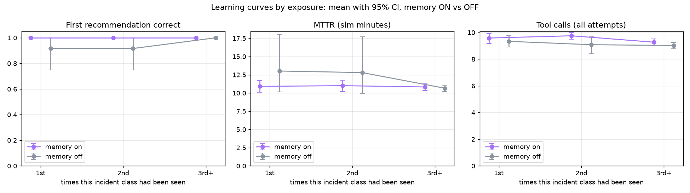
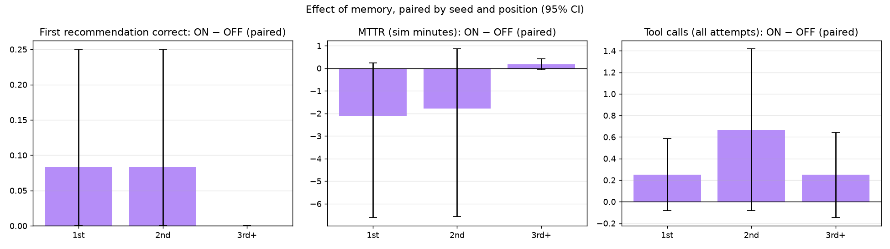
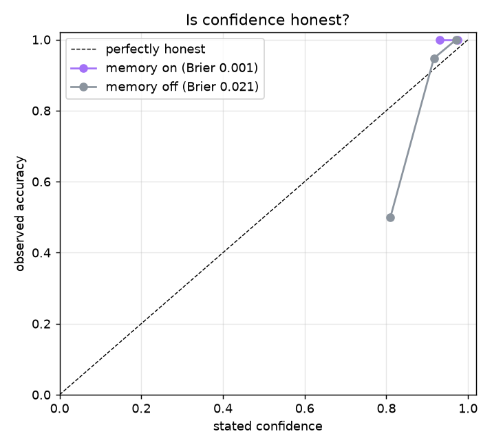

# MemoryOps evaluation — 20260929-053727-5de93f7

144 incident runs · seeds [1, 2, 3] · memory ON vs OFF, paired (same incidents, same order) · auto-approval · fast-forward clock (35 sim-s per tool call) · git `5de93f7` · model `openai:gpt-5.4-mini` · 2026-09-29T05:37:27+00:00

> ⚠️ **MEMORY NEVER MATCHED.** No memory-ON incident got a single match although same-class incidents were in memory. The memory layer was not working in this run; its memory-ON results measure the agent without memory. Do not use this run to judge memory.

## Acceptance targets (BUILD_PLAN 11.5)

| # | Target | Result | Evidence |
|---|---|---|---|
| 1 | Memory ON, 3rd+ exposure: recommendation accuracy higher than OFF (paired 95% CI excludes 0) | ❌ FAIL | +0% [+0%, +0%] (n=48) |
| 2 | Memory ON, 3rd+ exposure: tool calls and MTTR lower than OFF (paired 95% CIs exclude 0) | ❌ FAIL | tool calls +0.2 [-0.1, +0.6] (n=48); MTTR +0.2 min [-0.1, +0.4] (n=48) |
| 3 | Memory OFF: no significant trend from 1st to 3rd+ exposure (the gain is memory, not drift) | ✅ PASS | accuracy +8% [+0%, +25%] (n=60); tool_calls -0.3 [-0.8, +0.2] (n=60) |
| 4 | Discrimination: false replays ≤ 1 per 15 probes (memory ON) | ✅ PASS | 0 / 69 probes (0.0%) |
| 5 | Retrieval: recall@1 ≥ 0.8 when a same-class prior exists | ❌ FAIL | 0% [0%–6%] (n=60) |
| 6 | No harm: on textbook incidents memory does not lower accuracy (paired ON − OFF not significantly below 0) | ✅ PASS | +3% [+0%, +7%] (n=72) |

If a target is missed, the fix belongs in the agent or memory design — never in the metric.

## By family

### Textbook incidents (the fix follows from the evidence) — memory must not hurt

n = 72 incidents per condition.

| Exposure | Accuracy ON | Accuracy OFF | ON − OFF | Safe ON | Safe OFF | Tool calls ON | Tool calls OFF |
|---|---|---|---|---|---|---|---|
| 1st | 100% [100%–100%] n=12 | 92% [75%–100%] n=12 | +8% [+0%, +25%] (n=12) | 100% [100%–100%] n=12 | 100% [100%–100%] n=12 | 9.6 [9.2–9.9] n=12 | 9.3 [8.9–9.8] n=12 |
| 2nd | 100% [100%–100%] n=12 | 92% [75%–100%] n=12 | +8% [+0%, +25%] (n=12) | 100% [100%–100%] n=12 | 100% [100%–100%] n=12 | 9.8 [9.5–10.0] n=12 | 9.1 [8.4–9.7] n=12 |
| 3rd+ | 100% [100%–100%] n=48 | 100% [100%–100%] n=48 | +0% [+0%, +0%] (n=48) | 100% [100%–100%] n=48 | 100% [100%–100%] n=48 | 9.3 [9.0–9.5] n=48 | 9.0 [8.8–9.2] n=48 |

All exposures, paired ON − OFF: accuracy +3% [+0%, +7%] (n=72); tool calls +0.3 [+0.0, +0.6] (n=72); MTTR -0.5 min [-1.7, +0.3] (n=72).

The agent asked memory mid-investigation in 0 of 72 memory-ON incidents (0.00 calls per incident).

## Learning by exposure (all incidents)

Mean [95% bootstrap CI]; ON − OFF is paired by (seed, position).

**First recommendation correct**

| Exposure | Memory ON | Memory OFF | ON − OFF (paired) |
|---|---|---|---|
| 1st | 100% [100%–100%] n=12 | 92% [75%–100%] n=12 | +8% [+0%, +25%] (n=12) |
| 2nd | 100% [100%–100%] n=12 | 92% [75%–100%] n=12 | +8% [+0%, +25%] (n=12) |
| 3rd+ | 100% [100%–100%] n=48 | 100% [100%–100%] n=48 | +0% [+0%, +0%] (n=48) |

**Safe (right fix, or handed to a human)**

| Exposure | Memory ON | Memory OFF | ON − OFF (paired) |
|---|---|---|---|
| 1st | 100% [100%–100%] n=12 | 100% [100%–100%] n=12 | +0% [+0%, +0%] (n=12) |
| 2nd | 100% [100%–100%] n=12 | 100% [100%–100%] n=12 | +0% [+0%, +0%] (n=12) |
| 3rd+ | 100% [100%–100%] n=48 | 100% [100%–100%] n=48 | +0% [+0%, +0%] (n=48) |

**MTTR (sim minutes)**

| Exposure | Memory ON | Memory OFF | ON − OFF (paired) |
|---|---|---|---|
| 1st | 10.9 [10.1–11.7] n=12 | 13.0 [10.2–18.0] n=12 | -2.1 min [-6.6, +0.2] (n=12) |
| 2nd | 11.0 [10.2–11.7] n=12 | 12.8 [9.9–17.7] n=12 | -1.8 min [-6.6, +0.9] (n=12) |
| 3rd+ | 10.8 [10.4–11.3] n=48 | 10.7 [10.2–11.1] n=48 | +0.2 min [-0.1, +0.4] (n=48) |

**Tool calls (all attempts)**

| Exposure | Memory ON | Memory OFF | ON − OFF (paired) |
|---|---|---|---|
| 1st | 9.6 [9.2–9.9] n=12 | 9.3 [8.9–9.8] n=12 | +0.2 [-0.1, +0.6] (n=12) |
| 2nd | 9.8 [9.5–10.0] n=12 | 9.1 [8.4–9.7] n=12 | +0.7 [-0.1, +1.4] (n=12) |
| 3rd+ | 9.3 [9.0–9.5] n=48 | 9.0 [8.8–9.2] n=48 | +0.2 [-0.1, +0.6] (n=48) |

**Stated confidence**

| Exposure | Memory ON | Memory OFF | ON − OFF (paired) |
|---|---|---|---|
| 1st | 95% [94%–96%] n=12 | 94% [90%–97%] n=12 | +2% [-1%, +5%] (n=12) |
| 2nd | 97% [96%–98%] n=12 | 95% [93%–97%] n=12 | +2% [+0%, +3%] (n=12) |
| 3rd+ | 97% [97%–98%] n=48 | 96% [95%–96%] n=48 | +2% [+1%, +2%] (n=48) |





### What drives MTTR

| Exposure | Condition | Attempts (mean) | Wrong first fix | Escalated | n |
|---|---|---|---|---|---|
| 1st | memory_on | 1.00 | 0 | 0 | 12 |
| 1st | memory_off | 1.00 | 1 | 1 | 12 |
| 2nd | memory_on | 1.00 | 0 | 0 | 12 |
| 2nd | memory_off | 1.00 | 1 | 1 | 12 |
| 3rd+ | memory_on | 1.00 | 0 | 0 | 48 |
| 3rd+ | memory_off | 1.00 | 0 | 0 | 48 |

## Per class

| Class | Exposure | Accuracy ON | Accuracy OFF | MTTR ON | MTTR OFF | Tools ON | Tools OFF |
|---|---|---|---|---|---|---|---|
| config regression | 1st | 100% [100%–100%] n=3 | 100% [100%–100%] n=3 | 10.7 [10.1–11.1] n=3 | 10.7 [10.4–11.1] n=3 | 9.3 [9.0–10.0] n=3 | 9.3 [9.0–10.0] n=3 |
| config regression | 2nd | 100% [100%–100%] n=3 | 100% [100%–100%] n=3 | 11.1 [10.7–11.6] n=3 | 11.1 [10.1–12.2] n=3 | 9.7 [9.0–10.0] n=3 | 9.7 [9.0–10.0] n=3 |
| config regression | 3rd+ | 100% [100%–100%] n=12 | 100% [100%–100%] n=12 | 10.8 [10.4–11.2] n=12 | 10.5 [10.1–11.0] n=12 | 9.2 [8.8–9.7] n=12 | 8.8 [8.4–9.2] n=12 |
| sensor drift | 1st | 100% [100%–100%] n=3 | 67% [0%–100%] n=3 | 12.2 [11.5–12.7] n=3 | 21.0 [11.5–38.8] n=3 | 10.0 [10.0–10.0] n=3 | 9.7 [9.0–10.0] n=3 |
| sensor drift | 2nd | 100% [100%–100%] n=3 | 67% [0%–100%] n=3 | 11.3 [10.6–11.9] n=3 | 20.3 [11.2–38.5] n=3 | 9.3 [9.0–10.0] n=3 | 9.7 [9.0–10.0] n=3 |
| sensor drift | 3rd+ | 100% [100%–100%] n=12 | 100% [100%–100%] n=12 | 12.2 [11.7–12.8] n=12 | 12.1 [11.6–12.6] n=12 | 9.5 [9.1–9.8] n=12 | 9.3 [9.1–9.6] n=12 |
| network failure | 1st | 100% [100%–100%] n=3 | 100% [100%–100%] n=3 | 9.0 [9.0–9.0] n=3 | 9.0 [9.0–9.0] n=3 | 10.0 [10.0–10.0] n=3 | 10.0 [10.0–10.0] n=3 |
| network failure | 2nd | 100% [100%–100%] n=3 | 100% [100%–100%] n=3 | 9.0 [9.0–9.0] n=3 | 8.8 [8.4–9.0] n=3 | 10.0 [10.0–10.0] n=3 | 9.7 [9.0–10.0] n=3 |
| network failure | 3rd+ | 100% [100%–100%] n=12 | 100% [100%–100%] n=12 | 8.5 [8.0–8.9] n=12 | 8.6 [8.3–8.9] n=12 | 9.1 [8.3–9.8] n=12 | 9.3 [8.8–9.8] n=12 |
| resource exhaustion | 1st | 100% [100%–100%] n=3 | 100% [100%–100%] n=3 | 11.8 [10.3–13.4] n=3 | 11.4 [10.3–12.8] n=3 | 9.0 [8.0–10.0] n=3 | 8.3 [8.0–9.0] n=3 |
| resource exhaustion | 2nd | 100% [100%–100%] n=3 | 100% [100%–100%] n=3 | 12.6 [12.0–13.0] n=3 | 11.0 [10.1–11.8] n=3 | 10.0 [10.0–10.0] n=3 | 7.3 [7.0–8.0] n=3 |
| resource exhaustion | 3rd+ | 100% [100%–100%] n=12 | 100% [100%–100%] n=12 | 11.8 [11.4–12.1] n=12 | 11.3 [10.9–11.8] n=12 | 9.2 [8.8–9.8] n=12 | 8.6 [8.0–9.2] n=12 |

## Transfer to held-out machines

First exposure on M4–M5 after two exposures on M1–M3 — accuracy: memory ON 100% [76%–100%] (n=12), memory OFF 100% [76%–100%] (n=12). A same-class prior was among the matches in 0 of 12 (mean rank —).

## Discrimination

- **memory_on**: 0 false replays in 69 probes (incidents where memory already held another class; rate 0% [0%–5%] (n=69)); sensor drift right after a config regression: 0 / 18.
- **memory_off**: 0 false replays in 69 probes (incidents where memory already held another class; rate 0% [0%–5%] (n=69)); sensor drift right after a config regression: 0 / 18.

## Retrieval quality (memory ON)

- recall@1 when a same-class prior exists: 0% [0%–6%] (n=60)
- gate precision (matches of the same class): —
- precision of matches labelled *strong*: —
- incidents with no same-class prior that still got a match: 0 / 12 (mean matches per incident 0.0)

## Is confidence honest?

**memory_on** — Brier score 0.001 (0 = perfect, 0.25 = always saying 50%)

| Stated confidence | n | Mean stated | Observed accuracy |
|---|---|---|---|
| 0%–50% | 0 | — | — |
| 50%–70% | 0 | — | — |
| 70%–85% | 0 | — | — |
| 85%–95% | 9 | 93% | 100% |
| 95%–100% | 63 | 97% | 100% |

**memory_off** — Brier score 0.021 (0 = perfect, 0.25 = always saying 50%)

| Stated confidence | n | Mean stated | Observed accuracy |
|---|---|---|---|
| 0%–50% | 0 | — | — |
| 50%–70% | 0 | — | — |
| 70%–85% | 2 | 81% | 50% |
| 85%–95% | 19 | 92% | 95% |
| 95%–100% | 51 | 97% | 100% |



## Cost

| Condition | LLM tokens / incident | LLM $ / incident | Hindsight billed tokens (est.) | Hindsight $ (est.) | Runbook refreshes | Real s / incident |
|---|---|---|---|---|---|---|
| memory_on | 11,574 | $0.0105 | 5,920 | $0.0133 | 0.08 | 13.8 |
| memory_off | 10,695 | $0.0097 | 503 | $0.0099 | 0.10 | 13.5 |

Total: 144 incidents, 1,603,389 LLM tokens, $1.45 LLM + $1.67 Hindsight (estimated; the Hindsight billing page is authoritative).

## Where it fails

| Class | Condition | Seed | # | Incident | Machine | Seen | Recommended | Top match | Trace |
|---|---|---|---|---|---|---|---|---|---|
| sensor drift | memory_off | 3 | 4 | INC-004 | M2 | 1 | ESCALATE_HUMAN | — | [trace](https://us.cloud.langfuse.com/project/cmulf4hha07ngad0cidlo44fp/traces/ced015eb704331410c81f7dcfcc6ddb6) |
| sensor drift | memory_off | 3 | 6 | INC-006 | M2 | 2 | ESCALATE_HUMAN | — | [trace](https://us.cloud.langfuse.com/project/cmulf4hha07ngad0cidlo44fp/traces/9464012ee1e5598a636edf823d8ed66f) |

## Per-seed accuracy

Incidents within a seed share a world and a memory bank, so they are not independent; pooled CIs above assume they are. Per-seed means show how much seeds differ.

| Condition | seed 1 | seed 2 | seed 3 |
|---|---|---|---|
| memory_on | 100% | 100% | 100% |
| memory_off | 100% | 100% | 92% |

## Run metadata

```json
{
  "run_id": "20260929-053727-5de93f7",
  "started_at": "2026-09-29T05:37:27+00:00",
  "git_sha": "5de93f7",
  "git_dirty": false,
  "seeds": [
    1,
    2,
    3
  ],
  "incidents_per_unit": 24,
  "conditions": [
    "memory_on",
    "memory_off"
  ],
  "parallel": 3,
  "tool_call_sim_s": 35,
  "gap_between_incidents_sim_s": [
    7200,
    43200
  ],
  "llm_primary": "openai:gpt-5.4-mini",
  "llm_fallback": "groq:openai/gpt-oss-120b",
  "llm_reasoning_effort": "none",
  "llm_temperature": 0,
  "llm_seed": 42,
  "max_tool_calls": 10,
  "max_attempts": 3,
  "verify_window_sim_s": 180,
  "escalation_penalty_sim_s": 1800,
  "memory_match_rel_rerank": 0.15,
  "memory_match_min_rerank": 0.05,
  "pricing": {
    "llm": "OpenAI: developers.openai.com/api/docs/pricing, Standard tier, fetched 2026-09-28. Groq: account is on the free plan, so calls cost $0 (tokens still counted).",
    "hindsight": "Hindsight Cloud billing page, Operation rates, read 2026-09-29."
  },
  "python": "3.11.15",
  "packages": {
    "openai": "3.19.2",
    "hindsight-client": "0.10.1",
    "langgraph": "1.2.12",
    "langfuse": "4.15.6",
    "fastapi": "0.141.1"
  },
  "finished_at": "2026-09-29T05:50:17+00:00",
  "wall_clock_s": 770,
  "failed_units": [],
  "eval_spend_usd": 3.1254,
  "units_completed": 6
}
```
