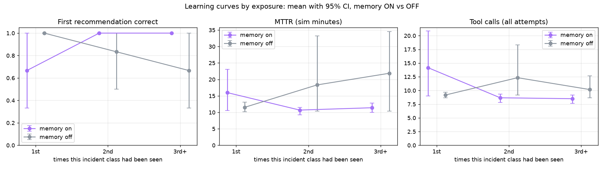
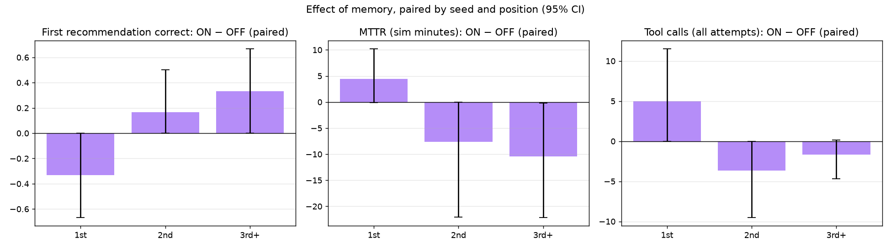
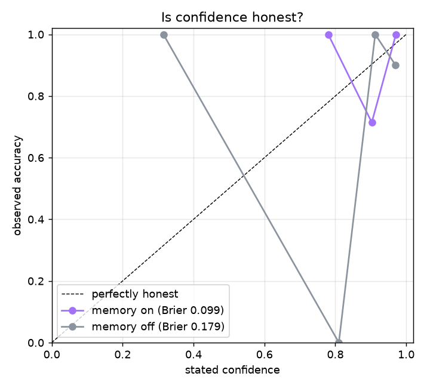

# MemoryOps evaluation — 20260929-055836-15637b2-quick

36 incident runs · seeds [1] · memory ON vs OFF, paired (same incidents, same order) · auto-approval · fast-forward clock (35 sim-s per tool call) · git `15637b2` · model `openai:gpt-5.4-mini` · 2026-09-29T05:58:36+00:00

> Memory matches in this run were gated without Hindsight's cross-encoder (passthrough reranker): llm_judge ×17 of 18 memory-ON incidents (BUILD_PLAN 6.3b).

## Acceptance targets (BUILD_PLAN 11.5)

| # | Target | Result | Evidence |
|---|---|---|---|
| 1 | Memory ON, 3rd+ exposure: recommendation accuracy higher than OFF (paired 95% CI excludes 0) | ❌ FAIL | +33% [+0%, +67%] (n=6) |
| 2 | Memory ON, 3rd+ exposure: tool calls and MTTR lower than OFF (paired 95% CIs exclude 0) | ❌ FAIL | tool calls -1.7 [-4.7, +0.2] (n=6); MTTR -10.5 min [-22.1, -0.2] (n=6) |
| 3 | Memory OFF: no significant trend from 1st to 3rd+ exposure (the gain is memory, not drift) | ✅ PASS | accuracy -33% [-67%, +0%] (n=12); tool_calls +1.0 [-0.7, +3.5] (n=12) |
| 4 | Discrimination: false replays ≤ 1 per 15 probes (memory ON) | ❌ FAIL | 2 / 17 probes (11.8%) |
| 5 | Retrieval: recall@1 ≥ 0.8 when a same-class prior exists | ❌ FAIL | 58% [32%–81%] (n=12) |
| 6 | No harm: on textbook incidents memory does not lower accuracy (paired ON − OFF not significantly below 0) | ✅ PASS | -8% [-25%, +0%] (n=12) |

If a target is missed, the fix belongs in the agent or memory design — never in the metric.

## By family

### Textbook incidents (the fix follows from the evidence) — memory must not hurt

n = 12 incidents per condition.

| Exposure | Accuracy ON | Accuracy OFF | ON − OFF | Safe ON | Safe OFF | Tool calls ON | Tool calls OFF |
|---|---|---|---|---|---|---|---|
| 1st | 75% [25%–100%] n=4 | 100% [100%–100%] n=4 | -25% [-75%, +0%] (n=4) | 75% [25%–100%] n=4 | 100% [100%–100%] n=4 | 12.0 [9.2–16.8] n=4 | 9.2 [8.5–10.0] n=4 |
| 2nd | 100% [100%–100%] n=4 | 100% [100%–100%] n=4 | +0% [+0%, +0%] (n=4) | 100% [100%–100%] n=4 | 100% [100%–100%] n=4 | 8.5 [7.5–9.5] n=4 | 9.5 [9.0–10.0] n=4 |
| 3rd+ | 100% [100%–100%] n=4 | 100% [100%–100%] n=4 | +0% [+0%, +0%] (n=4) | 100% [100%–100%] n=4 | 100% [100%–100%] n=4 | 8.5 [8.0–9.0] n=4 | 9.0 [8.2–9.8] n=4 |

All exposures, paired ON − OFF: accuracy -8% [-25%, +0%] (n=12); tool calls +0.4 [-0.9, +2.2] (n=12); MTTR +0.5 min [-0.5, +2.1] (n=12).

### Site-knowledge incidents (the fix is known only from a past resolution)

n = 6 incidents per condition.

| Exposure | Accuracy ON | Accuracy OFF | ON − OFF | Safe ON | Safe OFF | Tool calls ON | Tool calls OFF |
|---|---|---|---|---|---|---|---|
| 1st | 50% [0%–100%] n=2 | 100% [100%–100%] n=2 | -50% [-100%, +0%] (n=2) | 50% [0%–100%] n=2 | 100% [100%–100%] n=2 | 18.5 [8.0–29.0] n=2 | 9.0 [9.0–9.0] n=2 |
| 2nd | 100% [100%–100%] n=2 | 50% [0%–100%] n=2 | +50% [+0%, +100%] (n=2) | 100% [100%–100%] n=2 | 50% [0%–100%] n=2 | 9.0 [9.0–9.0] n=2 | 18.0 [9.0–27.0] n=2 |
| 3rd+ | 100% [100%–100%] n=2 | 0% [0%–0%] n=2 | +100% [+100%, +100%] (n=2) | 100% [100%–100%] n=2 | 50% [0%–100%] n=2 | 8.5 [7.0–10.0] n=2 | 12.5 [9.0–16.0] n=2 |

All exposures, paired ON − OFF: accuracy +33% [-33%, +83%] (n=6); tool calls -1.2 [-9.3, +8.5] (n=6); MTTR -14.7 min [-30.8, +2.8] (n=6).

The agent asked memory mid-investigation in 17 of 18 memory-ON incidents (1.11 calls per incident).

## Learning by exposure (all incidents)

Mean [95% bootstrap CI]; ON − OFF is paired by (seed, position).

**First recommendation correct**

| Exposure | Memory ON | Memory OFF | ON − OFF (paired) |
|---|---|---|---|
| 1st | 67% [33%–100%] n=6 | 100% [100%–100%] n=6 | -33% [-67%, +0%] (n=6) |
| 2nd | 100% [100%–100%] n=6 | 83% [50%–100%] n=6 | +17% [+0%, +50%] (n=6) |
| 3rd+ | 100% [100%–100%] n=6 | 67% [33%–100%] n=6 | +33% [+0%, +67%] (n=6) |

**Safe (right fix, or handed to a human)**

| Exposure | Memory ON | Memory OFF | ON − OFF (paired) |
|---|---|---|---|
| 1st | 67% [33%–100%] n=6 | 100% [100%–100%] n=6 | -33% [-67%, +0%] (n=6) |
| 2nd | 100% [100%–100%] n=6 | 83% [50%–100%] n=6 | +17% [+0%, +50%] (n=6) |
| 3rd+ | 100% [100%–100%] n=6 | 83% [50%–100%] n=6 | +17% [+0%, +50%] (n=6) |

**MTTR (sim minutes)**

| Exposure | Memory ON | Memory OFF | ON − OFF (paired) |
|---|---|---|---|
| 1st | 16.0 [10.6–23.0] n=6 | 11.5 [10.2–13.1] n=6 | +4.4 min [-0.1, +10.2] (n=6) |
| 2nd | 10.7 [9.3–11.5] n=6 | 18.3 [10.3–33.2] n=6 | -7.6 min [-22.1, -0.0] (n=6) |
| 3rd+ | 11.4 [10.0–12.8] n=6 | 21.9 [10.4–34.5] n=6 | -10.5 min [-22.1, -0.2] (n=6) |

**Tool calls (all attempts)**

| Exposure | Memory ON | Memory OFF | ON − OFF (paired) |
|---|---|---|---|
| 1st | 14.2 [9.0–20.8] n=6 | 9.2 [8.7–9.7] n=6 | +5.0 [+0.0, +11.5] (n=6) |
| 2nd | 8.7 [7.8–9.3] n=6 | 12.3 [9.2–18.3] n=6 | -3.7 [-9.5, +0.0] (n=6) |
| 3rd+ | 8.5 [7.7–9.2] n=6 | 10.2 [8.7–12.7] n=6 | -1.7 [-4.7, +0.2] (n=6) |

**Stated confidence**

| Exposure | Memory ON | Memory OFF | ON − OFF (paired) |
|---|---|---|---|
| 1st | 90% [85%–95%] n=6 | 86% [67%–97%] n=6 | +5% [-4%, +18%] (n=6) |
| 2nd | 94% [90%–97%] n=6 | 84% [59%–97%] n=6 | +10% [-4%, +35%] (n=6) |
| 3rd+ | 96% [94%–98%] n=6 | 91% [85%–96%] n=6 | +5% [+2%, +10%] (n=6) |





### What drives MTTR

| Exposure | Condition | Attempts (mean) | Wrong first fix | Escalated | n |
|---|---|---|---|---|---|
| 1st | memory_on | 1.50 | 2 | 0 | 6 |
| 1st | memory_off | 1.00 | 0 | 0 | 6 |
| 2nd | memory_on | 1.00 | 0 | 0 | 6 |
| 2nd | memory_off | 1.17 | 1 | 1 | 6 |
| 3rd+ | memory_on | 1.00 | 0 | 0 | 6 |
| 3rd+ | memory_off | 1.00 | 2 | 2 | 6 |

## Per class

| Class | Exposure | Accuracy ON | Accuracy OFF | MTTR ON | MTTR OFF | Tools ON | Tools OFF |
|---|---|---|---|---|---|---|---|
| config regression | 1st | 0% [0%–0%] n=1 | 100% [100%–100%] n=1 | 19.6 [19.6–19.6] n=1 | 11.3 [11.3–11.3] n=1 | 19.0 [19.0–19.0] n=1 | 10.0 [10.0–10.0] n=1 |
| config regression | 2nd | 100% [100%–100%] n=1 | 100% [100%–100%] n=1 | 11.7 [11.7–11.7] n=1 | 11.1 [11.1–11.1] n=1 | 10.0 [10.0–10.0] n=1 | 9.0 [9.0–9.0] n=1 |
| config regression | 3rd+ | 100% [100%–100%] n=1 | 100% [100%–100%] n=1 | 10.0 [10.0–10.0] n=1 | 10.6 [10.6–10.6] n=1 | 8.0 [8.0–8.0] n=1 | 9.0 [9.0–9.0] n=1 |
| sensor drift | 1st | 100% [100%–100%] n=1 | 100% [100%–100%] n=1 | 13.7 [13.7–13.7] n=1 | 12.2 [12.2–12.2] n=1 | 10.0 [10.0–10.0] n=1 | 8.0 [8.0–8.0] n=1 |
| sensor drift | 2nd | 100% [100%–100%] n=1 | 100% [100%–100%] n=1 | 11.2 [11.2–11.2] n=1 | 12.2 [12.2–12.2] n=1 | 8.0 [8.0–8.0] n=1 | 10.0 [10.0–10.0] n=1 |
| sensor drift | 3rd+ | 100% [100%–100%] n=1 | 100% [100%–100%] n=1 | 11.6 [11.6–11.6] n=1 | 12.2 [12.2–12.2] n=1 | 9.0 [9.0–9.0] n=1 | 10.0 [10.0–10.0] n=1 |
| network failure | 1st | 100% [100%–100%] n=1 | 100% [100%–100%] n=1 | 8.4 [8.4–8.4] n=1 | 9.0 [9.0–9.0] n=1 | 9.0 [9.0–9.0] n=1 | 10.0 [10.0–10.0] n=1 |
| network failure | 2nd | 100% [100%–100%] n=1 | 100% [100%–100%] n=1 | 7.2 [7.2–7.2] n=1 | 9.0 [9.0–9.0] n=1 | 7.0 [7.0–7.0] n=1 | 10.0 [10.0–10.0] n=1 |
| network failure | 3rd+ | 100% [100%–100%] n=1 | 100% [100%–100%] n=1 | 8.4 [8.4–8.4] n=1 | 8.4 [8.4–8.4] n=1 | 9.0 [9.0–9.0] n=1 | 9.0 [9.0–9.0] n=1 |
| resource exhaustion | 1st | 100% [100%–100%] n=1 | 100% [100%–100%] n=1 | 11.3 [11.3–11.3] n=1 | 10.9 [10.9–10.9] n=1 | 10.0 [10.0–10.0] n=1 | 9.0 [9.0–9.0] n=1 |
| resource exhaustion | 2nd | 100% [100%–100%] n=1 | 100% [100%–100%] n=1 | 11.6 [11.6–11.6] n=1 | 11.8 [11.8–11.8] n=1 | 9.0 [9.0–9.0] n=1 | 9.0 [9.0–9.0] n=1 |
| resource exhaustion | 3rd+ | 100% [100%–100%] n=1 | 100% [100%–100%] n=1 | 12.0 [12.0–12.0] n=1 | 12.0 [12.0–12.0] n=1 | 8.0 [8.0–8.0] n=1 | 8.0 [8.0–8.0] n=1 |
| vision link dropout | 1st | 100% [100%–100%] n=1 | 100% [100%–100%] n=1 | 10.2 [10.2–10.2] n=1 | 10.8 [10.8–10.8] n=1 | 8.0 [8.0–8.0] n=1 | 9.0 [9.0–9.0] n=1 |
| vision link dropout | 2nd | 100% [100%–100%] n=1 | 100% [100%–100%] n=1 | 10.9 [10.9–10.9] n=1 | 10.9 [10.9–10.9] n=1 | 9.0 [9.0–9.0] n=1 | 9.0 [9.0–9.0] n=1 |
| vision link dropout | 3rd+ | 100% [100%–100%] n=1 | 0% [0%–0%] n=1 | 12.2 [12.2–12.2] n=1 | 47.5 [47.5–47.5] n=1 | 7.0 [7.0–7.0] n=1 | 16.0 [16.0–16.0] n=1 |
| servo tuning drift | 1st | 0% [0%–0%] n=1 | 100% [100%–100%] n=1 | 32.8 [32.8–32.8] n=1 | 15.1 [15.1–15.1] n=1 | 29.0 [29.0–29.0] n=1 | 9.0 [9.0–9.0] n=1 |
| servo tuning drift | 2nd | 100% [100%–100%] n=1 | 0% [0%–0%] n=1 | 11.6 [11.6–11.6] n=1 | 55.1 [55.1–55.1] n=1 | 9.0 [9.0–9.0] n=1 | 27.0 [27.0–27.0] n=1 |
| servo tuning drift | 3rd+ | 100% [100%–100%] n=1 | 0% [0%–0%] n=1 | 14.2 [14.2–14.2] n=1 | 40.6 [40.6–40.6] n=1 | 10.0 [10.0–10.0] n=1 | 9.0 [9.0–9.0] n=1 |

## Transfer to held-out machines

First exposure on M4–M5 after two exposures on M1–M3 — accuracy: memory ON 100% [61%–100%] (n=6), memory OFF 67% [30%–90%] (n=6). A same-class prior was among the matches in 4 of 6 (mean rank 1.0).

## Discrimination

- **memory_on**: 2 false replays in 17 probes (incidents where memory already held another class; rate 12% [3%–34%] (n=17)); sensor drift right after a config regression: 0 / 3.
- **memory_off**: 2 false replays in 17 probes (incidents where memory already held another class; rate 12% [3%–34%] (n=17)); sensor drift right after a config regression: 0 / 3.

## Retrieval quality (memory ON)

- recall@1 when a same-class prior exists: 58% [32%–81%] (n=12)
- gate precision (matches of the same class): 60% [36%–80%] (n=15)
- precision of matches labelled *strong*: 60% [36%–80%] (n=15)
- incidents with no same-class prior that still got a match: 1 / 6 (mean matches per incident 0.83)

## Is confidence honest?

**memory_on** — Brier score 0.099 (0 = perfect, 0.25 = always saying 50%)

| Stated confidence | n | Mean stated | Observed accuracy |
|---|---|---|---|
| 0%–50% | 0 | — | — |
| 50%–70% | 0 | — | — |
| 70%–85% | 1 | 78% | 100% |
| 85%–95% | 7 | 90% | 71% |
| 95%–100% | 10 | 97% | 100% |

**memory_off** — Brier score 0.179 (0 = perfect, 0.25 = always saying 50%)

| Stated confidence | n | Mean stated | Observed accuracy |
|---|---|---|---|
| 0%–50% | 2 | 32% | 100% |
| 50%–70% | 0 | — | — |
| 70%–85% | 2 | 81% | 0% |
| 85%–95% | 4 | 91% | 100% |
| 95%–100% | 10 | 97% | 90% |



## Cost

| Condition | LLM tokens / incident | LLM $ / incident | Hindsight billed tokens (est.) | Hindsight $ (est.) | Runbook refreshes | Real s / incident |
|---|---|---|---|---|---|---|
| memory_on | 22,011 | $0.0146 | 9,528 | $0.0263 | 0.28 | 27.0 |
| memory_off | 12,693 | $0.0109 | 560 | $0.0223 | 0.33 | 17.5 |

Total: 36 incidents, 624,674 LLM tokens, $0.46 LLM + $0.87 Hindsight (estimated; the Hindsight billing page is authoritative).

## Where it fails

| Class | Condition | Seed | # | Incident | Machine | Seen | Recommended | Top match | Trace |
|---|---|---|---|---|---|---|---|---|---|
| config regression | memory_on | 1 | 4 | INC-004 | M1 | 1 | RESTART_MACHINE ⚠ false replay | INC-003 (servo tuning drift, 0.86) | [trace](https://us.cloud.langfuse.com/project/cmulf4hha07ngad0cidlo44fp/traces/f8256f53e91168de213d86b9dc2bd3f8) |
| servo tuning drift | memory_off | 1 | 11 | INC-011 | M3 | 2 | ROLLBACK_CONFIG ⚠ false replay | — | [trace](https://us.cloud.langfuse.com/project/cmulf4hha07ngad0cidlo44fp/traces/b323a7d951a54f155c76c1e2b9f7ca2e) |
| servo tuning drift | memory_off | 1 | 14 | INC-014 | M5 | 3 | ESCALATE_HUMAN | — | [trace](https://us.cloud.langfuse.com/project/cmulf4hha07ngad0cidlo44fp/traces/4e30c6633f8ccb7e816742e632dde007) |
| servo tuning drift | memory_on | 1 | 3 | INC-003 | M2 | 1 | ROLLBACK_CONFIG ⚠ false replay | — | [trace](https://us.cloud.langfuse.com/project/cmulf4hha07ngad0cidlo44fp/traces/e32d56d177c9edee7831f12ca0f9de9b) |
| vision link dropout | memory_off | 1 | 13 | INC-013 | M4 | 3 | RESTART_MACHINE ⚠ false replay | — | [trace](https://us.cloud.langfuse.com/project/cmulf4hha07ngad0cidlo44fp/traces/5b04a45f37f732d652d27aa3ae21834e) |

## Per-seed accuracy

Incidents within a seed share a world and a memory bank, so they are not independent; pooled CIs above assume they are. Per-seed means show how much seeds differ.

| Condition | seed 1 |
|---|---|
| memory_on | 89% |
| memory_off | 83% |

## Run metadata

```json
{
  "run_id": "20260929-055836-15637b2-quick",
  "started_at": "2026-09-29T05:58:36+00:00",
  "git_sha": "15637b2",
  "git_dirty": false,
  "seeds": [
    1
  ],
  "incidents_per_unit": 18,
  "battery": "full",
  "conditions": [
    "memory_on",
    "memory_off"
  ],
  "parallel": 2,
  "tool_call_sim_s": 35,
  "gap_between_incidents_sim_s": [
    7200,
    43200
  ],
  "llm_primary": "openai:gpt-5.4-mini",
  "llm_fallback": "groq:openai/gpt-oss-120b",
  "llm_reasoning_effort": "none",
  "llm_temperature": 0,
  "llm_seed": 42,
  "max_tool_calls": 10,
  "max_attempts": 3,
  "verify_window_sim_s": 180,
  "escalation_penalty_sim_s": 1800,
  "memory_match_rel_rerank": 0.15,
  "memory_match_min_rerank": 0.05,
  "pricing": {
    "llm": "OpenAI: developers.openai.com/api/docs/pricing, Standard tier, fetched 2026-09-28. Groq: account is on the free plan, so calls cost $0 (tokens still counted).",
    "hindsight": "Hindsight Cloud billing page, Operation rates, read 2026-09-29."
  },
  "python": "3.11.15",
  "packages": {
    "openai": "3.19.2",
    "hindsight-client": "0.10.1",
    "langgraph": "1.2.12",
    "langfuse": "4.15.6",
    "fastapi": "0.141.1"
  },
  "finished_at": "2026-09-29T06:07:27+00:00",
  "wall_clock_s": 531,
  "failed_units": [],
  "eval_spend_usd": 1.3318,
  "units_completed": 2
}
```
