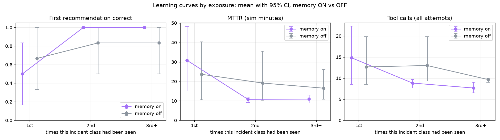
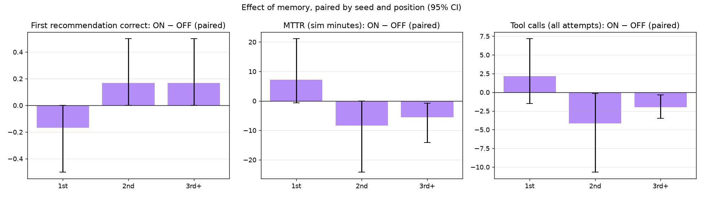
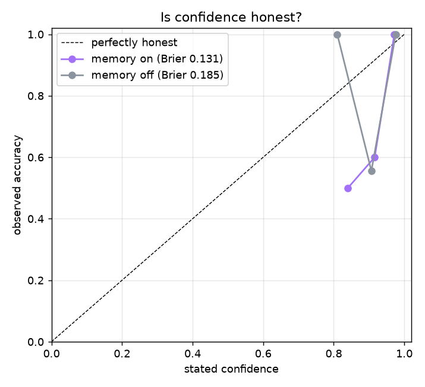

# MemoryOps evaluation — 20260929-060951-915683f-quick

36 incident runs · seeds [1] · memory ON vs OFF, paired (same incidents, same order) · auto-approval · fast-forward clock (35 sim-s per tool call) · git `915683f` · model `openai:gpt-5.4-mini` · 2026-09-29T06:09:51+00:00

> Memory matches in this run were gated without Hindsight's cross-encoder (passthrough reranker): llm_judge ×17 of 18 memory-ON incidents (BUILD_PLAN 6.3b).

## Acceptance targets (BUILD_PLAN 11.5)

| # | Target | Result | Evidence |
|---|---|---|---|
| 1 | Memory ON, 3rd+ exposure: recommendation accuracy higher than OFF (paired 95% CI excludes 0) | ❌ FAIL | +17% [+0%, +50%] (n=6) |
| 2 | Memory ON, 3rd+ exposure: tool calls and MTTR lower than OFF (paired 95% CIs exclude 0) | ✅ PASS | tool calls -2.0 [-3.5, -0.3] (n=6); MTTR -5.6 min [-14.1, -0.8] (n=6) |
| 3 | Memory OFF: no significant trend from 1st to 3rd+ exposure (the gain is memory, not drift) | ✅ PASS | accuracy +17% [-33%, +67%] (n=12); tool_calls -3.0 [-10.2, +1.3] (n=12) |
| 4 | Discrimination: false replays ≤ 1 per 15 probes (memory ON) | ❌ FAIL | 2 / 17 probes (11.8%) |
| 5 | Retrieval: recall@1 ≥ 0.8 when a same-class prior exists | ✅ PASS | 83% [55%–95%] (n=12) |
| 6 | No harm: on textbook incidents memory does not lower accuracy (paired ON − OFF not significantly below 0) | ✅ PASS | -8% [-25%, +0%] (n=12) |

If a target is missed, the fix belongs in the agent or memory design — never in the metric.

## By family

### Textbook incidents (the fix follows from the evidence) — memory must not hurt

n = 12 incidents per condition.

| Exposure | Accuracy ON | Accuracy OFF | ON − OFF | Safe ON | Safe OFF | Tool calls ON | Tool calls OFF |
|---|---|---|---|---|---|---|---|
| 1st | 75% [25%–100%] n=4 | 100% [100%–100%] n=4 | -25% [-75%, +0%] (n=4) | 75% [25%–100%] n=4 | 100% [100%–100%] n=4 | 13.0 [8.5–20.5] n=4 | 9.0 [7.8–10.0] n=4 |
| 2nd | 100% [100%–100%] n=4 | 100% [100%–100%] n=4 | +0% [+0%, +0%] (n=4) | 100% [100%–100%] n=4 | 100% [100%–100%] n=4 | 8.5 [6.8–9.8] n=4 | 9.8 [9.2–10.0] n=4 |
| 3rd+ | 100% [100%–100%] n=4 | 100% [100%–100%] n=4 | +0% [+0%, +0%] (n=4) | 100% [100%–100%] n=4 | 100% [100%–100%] n=4 | 6.8 [6.0–8.2] n=4 | 10.0 [10.0–10.0] n=4 |

All exposures, paired ON − OFF: accuracy -8% [-25%, +0%] (n=12); tool calls -0.2 [-2.4, +2.8] (n=12); MTTR +2.6 min [-1.4, +9.9] (n=12).

### Site-knowledge incidents (the fix is known only from a past resolution)

n = 6 incidents per condition.

| Exposure | Accuracy ON | Accuracy OFF | ON − OFF | Safe ON | Safe OFF | Tool calls ON | Tool calls OFF |
|---|---|---|---|---|---|---|---|
| 1st | 0% [0%–0%] n=2 | 0% [0%–0%] n=2 | +0% [+0%, +0%] (n=2) | 50% [0%–100%] n=2 | 50% [0%–100%] n=2 | 18.5 [7.0–30.0] n=2 | 20.0 [10.0–30.0] n=2 |
| 2nd | 100% [100%–100%] n=2 | 50% [0%–100%] n=2 | +50% [+0%, +100%] (n=2) | 100% [100%–100%] n=2 | 50% [0%–100%] n=2 | 9.5 [9.0–10.0] n=2 | 19.5 [9.0–30.0] n=2 |
| 3rd+ | 100% [100%–100%] n=2 | 50% [0%–100%] n=2 | +50% [+0%, +100%] (n=2) | 100% [100%–100%] n=2 | 100% [100%–100%] n=2 | 9.5 [9.0–10.0] n=2 | 9.0 [8.0–10.0] n=2 |

All exposures, paired ON − OFF: accuracy +33% [+0%, +67%] (n=6); tool calls -3.7 [-10.3, +0.3] (n=6); MTTR -12.0 min [-28.1, +0.9] (n=6).

The agent asked memory mid-investigation in 18 of 18 memory-ON incidents (1.22 calls per incident).

## Learning by exposure (all incidents)

Mean [95% bootstrap CI]; ON − OFF is paired by (seed, position).

**First recommendation correct**

| Exposure | Memory ON | Memory OFF | ON − OFF (paired) |
|---|---|---|---|
| 1st | 50% [17%–83%] n=6 | 67% [33%–100%] n=6 | -17% [-50%, +0%] (n=6) |
| 2nd | 100% [100%–100%] n=6 | 83% [50%–100%] n=6 | +17% [+0%, +50%] (n=6) |
| 3rd+ | 100% [100%–100%] n=6 | 83% [50%–100%] n=6 | +17% [+0%, +50%] (n=6) |

**Safe (right fix, or handed to a human)**

| Exposure | Memory ON | Memory OFF | ON − OFF (paired) |
|---|---|---|---|
| 1st | 67% [33%–100%] n=6 | 83% [50%–100%] n=6 | -17% [-50%, +0%] (n=6) |
| 2nd | 100% [100%–100%] n=6 | 83% [50%–100%] n=6 | +17% [+0%, +50%] (n=6) |
| 3rd+ | 100% [100%–100%] n=6 | 100% [100%–100%] n=6 | +0% [+0%, +0%] (n=6) |

**MTTR (sim minutes)**

| Exposure | Memory ON | Memory OFF | ON − OFF (paired) |
|---|---|---|---|
| 1st | 30.8 [15.1–48.2] n=6 | 23.6 [10.6–40.3] n=6 | +7.2 min [-0.6, +21.1] (n=6) |
| 2nd | 10.8 [9.1–11.9] n=6 | 19.2 [10.3–35.5] n=6 | -8.4 min [-24.1, -0.0] (n=6) |
| 3rd+ | 10.9 [8.9–12.9] n=6 | 16.5 [10.9–26.1] n=6 | -5.6 min [-14.1, -0.8] (n=6) |

**Tool calls (all attempts)**

| Exposure | Memory ON | Memory OFF | ON − OFF (paired) |
|---|---|---|---|
| 1st | 14.8 [8.5–22.3] n=6 | 12.7 [8.5–19.8] n=6 | +2.2 [-1.5, +7.2] (n=6) |
| 2nd | 8.8 [7.7–9.7] n=6 | 13.0 [9.3–19.8] n=6 | -4.2 [-10.7, -0.2] (n=6) |
| 3rd+ | 7.7 [6.5–9.0] n=6 | 9.7 [9.0–10.0] n=6 | -2.0 [-3.5, -0.3] (n=6) |

**Stated confidence**

| Exposure | Memory ON | Memory OFF | ON − OFF (paired) |
|---|---|---|---|
| 1st | 91% [87%–94%] n=6 | 93% [89%–97%] n=6 | -2% [-8%, +4%] (n=6) |
| 2nd | 95% [90%–98%] n=6 | 92% [86%–96%] n=6 | +2% [-1%, +5%] (n=6) |
| 3rd+ | 97% [96%–98%] n=6 | 92% [88%–96%] n=6 | +5% [+1%, +9%] (n=6) |





### What drives MTTR

| Exposure | Condition | Attempts (mean) | Wrong first fix | Escalated | n |
|---|---|---|---|---|---|
| 1st | memory_on | 1.50 | 3 | 3 | 6 |
| 1st | memory_off | 1.17 | 2 | 2 | 6 |
| 2nd | memory_on | 1.00 | 0 | 0 | 6 |
| 2nd | memory_off | 1.33 | 1 | 1 | 6 |
| 3rd+ | memory_on | 1.00 | 0 | 0 | 6 |
| 3rd+ | memory_off | 1.00 | 1 | 1 | 6 |

## Per class

| Class | Exposure | Accuracy ON | Accuracy OFF | MTTR ON | MTTR OFF | Tools ON | Tools OFF |
|---|---|---|---|---|---|---|---|
| config regression | 1st | 0% [0%–0%] n=1 | 100% [100%–100%] n=1 | 52.5 [52.5–52.5] n=1 | 11.3 [11.3–11.3] n=1 | 24.0 [24.0–24.0] n=1 | 10.0 [10.0–10.0] n=1 |
| config regression | 2nd | 100% [100%–100%] n=1 | 100% [100%–100%] n=1 | 11.1 [11.1–11.1] n=1 | 11.1 [11.1–11.1] n=1 | 9.0 [9.0–9.0] n=1 | 9.0 [9.0–9.0] n=1 |
| config regression | 3rd+ | 100% [100%–100%] n=1 | 100% [100%–100%] n=1 | 8.8 [8.8–8.8] n=1 | 11.2 [11.2–11.2] n=1 | 6.0 [6.0–6.0] n=1 | 10.0 [10.0–10.0] n=1 |
| sensor drift | 1st | 100% [100%–100%] n=1 | 100% [100%–100%] n=1 | 13.3 [13.3–13.3] n=1 | 11.6 [11.6–11.6] n=1 | 10.0 [10.0–10.0] n=1 | 7.0 [7.0–7.0] n=1 |
| sensor drift | 2nd | 100% [100%–100%] n=1 | 100% [100%–100%] n=1 | 12.2 [12.2–12.2] n=1 | 12.3 [12.3–12.3] n=1 | 10.0 [10.0–10.0] n=1 | 10.0 [10.0–10.0] n=1 |
| sensor drift | 3rd+ | 100% [100%–100%] n=1 | 100% [100%–100%] n=1 | 11.6 [11.6–11.6] n=1 | 12.2 [12.2–12.2] n=1 | 9.0 [9.0–9.0] n=1 | 10.0 [10.0–10.0] n=1 |
| network failure | 1st | 100% [100%–100%] n=1 | 100% [100%–100%] n=1 | 7.8 [7.8–7.8] n=1 | 9.0 [9.0–9.0] n=1 | 8.0 [8.0–8.0] n=1 | 10.0 [10.0–10.0] n=1 |
| network failure | 2nd | 100% [100%–100%] n=1 | 100% [100%–100%] n=1 | 6.7 [6.7–6.7] n=1 | 9.0 [9.0–9.0] n=1 | 6.0 [6.0–6.0] n=1 | 10.0 [10.0–10.0] n=1 |
| network failure | 3rd+ | 100% [100%–100%] n=1 | 100% [100%–100%] n=1 | 6.7 [6.7–6.7] n=1 | 9.0 [9.0–9.0] n=1 | 6.0 [6.0–6.0] n=1 | 10.0 [10.0–10.0] n=1 |
| resource exhaustion | 1st | 100% [100%–100%] n=1 | 100% [100%–100%] n=1 | 11.5 [11.5–11.5] n=1 | 11.4 [11.4–11.4] n=1 | 10.0 [10.0–10.0] n=1 | 9.0 [9.0–9.0] n=1 |
| resource exhaustion | 2nd | 100% [100%–100%] n=1 | 100% [100%–100%] n=1 | 11.8 [11.8–11.8] n=1 | 12.3 [12.3–12.3] n=1 | 9.0 [9.0–9.0] n=1 | 10.0 [10.0–10.0] n=1 |
| resource exhaustion | 3rd+ | 100% [100%–100%] n=1 | 100% [100%–100%] n=1 | 10.8 [10.8–10.8] n=1 | 13.0 [13.0–13.0] n=1 | 6.0 [6.0–6.0] n=1 | 10.0 [10.0–10.0] n=1 |
| vision link dropout | 1st | 0% [0%–0%] n=1 | 0% [0%–0%] n=1 | 36.6 [36.6–36.6] n=1 | 38.3 [38.3–38.3] n=1 | 7.0 [7.0–7.0] n=1 | 10.0 [10.0–10.0] n=1 |
| vision link dropout | 2nd | 100% [100%–100%] n=1 | 100% [100%–100%] n=1 | 10.9 [10.9–10.9] n=1 | 10.6 [10.6–10.6] n=1 | 9.0 [9.0–9.0] n=1 | 9.0 [9.0–9.0] n=1 |
| vision link dropout | 3rd+ | 100% [100%–100%] n=1 | 0% [0%–0%] n=1 | 13.4 [13.4–13.4] n=1 | 39.8 [39.8–39.8] n=1 | 9.0 [9.0–9.0] n=1 | 8.0 [8.0–8.0] n=1 |
| servo tuning drift | 1st | 0% [0%–0%] n=1 | 0% [0%–0%] n=1 | 63.3 [63.3–63.3] n=1 | 60.2 [60.2–60.2] n=1 | 30.0 [30.0–30.0] n=1 | 30.0 [30.0–30.0] n=1 |
| servo tuning drift | 2nd | 100% [100%–100%] n=1 | 0% [0%–0%] n=1 | 12.2 [12.2–12.2] n=1 | 59.7 [59.7–59.7] n=1 | 10.0 [10.0–10.0] n=1 | 30.0 [30.0–30.0] n=1 |
| servo tuning drift | 3rd+ | 100% [100%–100%] n=1 | 100% [100%–100%] n=1 | 14.2 [14.2–14.2] n=1 | 14.0 [14.0–14.0] n=1 | 10.0 [10.0–10.0] n=1 | 10.0 [10.0–10.0] n=1 |

## Transfer to held-out machines

First exposure on M4–M5 after two exposures on M1–M3 — accuracy: memory ON 100% [61%–100%] (n=6), memory OFF 83% [44%–97%] (n=6). A same-class prior was among the matches in 5 of 6 (mean rank 1.0).

## Discrimination

- **memory_on**: 2 false replays in 17 probes (incidents where memory already held another class; rate 12% [3%–34%] (n=17)); sensor drift right after a config regression: 0 / 3.
- **memory_off**: 2 false replays in 17 probes (incidents where memory already held another class; rate 12% [3%–34%] (n=17)); sensor drift right after a config regression: 0 / 3.

## Retrieval quality (memory ON)

- recall@1 when a same-class prior exists: 83% [55%–95%] (n=12)
- gate precision (matches of the same class): 82% [59%–94%] (n=17)
- precision of matches labelled *strong*: 82% [59%–94%] (n=17)
- incidents with no same-class prior that still got a match: 3 / 6 (mean matches per incident 0.94)

## Is confidence honest?

**memory_on** — Brier score 0.131 (0 = perfect, 0.25 = always saying 50%)

| Stated confidence | n | Mean stated | Observed accuracy |
|---|---|---|---|
| 0%–50% | 0 | — | — |
| 50%–70% | 0 | — | — |
| 70%–85% | 2 | 84% | 50% |
| 85%–95% | 5 | 92% | 60% |
| 95%–100% | 11 | 97% | 100% |

**memory_off** — Brier score 0.185 (0 = perfect, 0.25 = always saying 50%)

| Stated confidence | n | Mean stated | Observed accuracy |
|---|---|---|---|
| 0%–50% | 0 | — | — |
| 50%–70% | 0 | — | — |
| 70%–85% | 2 | 81% | 100% |
| 85%–95% | 9 | 91% | 56% |
| 95%–100% | 7 | 98% | 100% |



## Cost

| Condition | LLM tokens / incident | LLM $ / incident | Hindsight billed tokens (est.) | Hindsight $ (est.) | Runbook refreshes | Real s / incident |
|---|---|---|---|---|---|---|
| memory_on | 24,593 | $0.0165 | 10,624 | $0.0301 | 0.33 | 25.0 |
| memory_off | 13,560 | $0.0128 | 578 | $0.0224 | 0.33 | 18.8 |

Total: 36 incidents, 686,753 LLM tokens, $0.53 LLM + $0.95 Hindsight (estimated; the Hindsight billing page is authoritative).

## Where it fails

| Class | Condition | Seed | # | Incident | Machine | Seen | Recommended | Top match | Trace |
|---|---|---|---|---|---|---|---|---|---|
| config regression | memory_on | 1 | 4 | INC-004 | M1 | 1 | RESTART_MACHINE ⚠ false replay | INC-003 (servo tuning drift, 0.78) | [trace](https://us.cloud.langfuse.com/project/cmulf4hha07ngad0cidlo44fp/traces/a0f0f94bc29529845086b119b6f3cca9) |
| servo tuning drift | memory_off | 1 | 3 | INC-003 | M2 | 1 | ROLLBACK_CONFIG ⚠ false replay | — | [trace](https://us.cloud.langfuse.com/project/cmulf4hha07ngad0cidlo44fp/traces/8c78b45e1756a95122c2a9b2f72b76c0) |
| servo tuning drift | memory_off | 1 | 11 | INC-011 | M3 | 2 | ROLLBACK_CONFIG ⚠ false replay | — | [trace](https://us.cloud.langfuse.com/project/cmulf4hha07ngad0cidlo44fp/traces/5824428e1d8ce9069086858c1a10368b) |
| servo tuning drift | memory_on | 1 | 3 | INC-003 | M2 | 1 | RECALIBRATE_SENSOR ⚠ false replay | — | [trace](https://us.cloud.langfuse.com/project/cmulf4hha07ngad0cidlo44fp/traces/5f7810ac41aa937e0f362ef2c7a4b491) |
| vision link dropout | memory_off | 1 | 1 | INC-001 | M3 | 1 | ESCALATE_HUMAN | — | [trace](https://us.cloud.langfuse.com/project/cmulf4hha07ngad0cidlo44fp/traces/7184576aa50c4361e6c8628e44f336e1) |
| vision link dropout | memory_off | 1 | 13 | INC-013 | M4 | 3 | ESCALATE_HUMAN | — | [trace](https://us.cloud.langfuse.com/project/cmulf4hha07ngad0cidlo44fp/traces/f98fddbc3aa3a2803571eea7f1b45b96) |
| vision link dropout | memory_on | 1 | 1 | INC-001 | M3 | 1 | ESCALATE_HUMAN | — | [trace](https://us.cloud.langfuse.com/project/cmulf4hha07ngad0cidlo44fp/traces/9f1ec5974796b0fb9746b31da1b909c9) |

## Per-seed accuracy

Incidents within a seed share a world and a memory bank, so they are not independent; pooled CIs above assume they are. Per-seed means show how much seeds differ.

| Condition | seed 1 |
|---|---|
| memory_on | 83% |
| memory_off | 78% |

## Run metadata

```json
{
  "run_id": "20260929-060951-915683f-quick",
  "started_at": "2026-09-29T06:09:51+00:00",
  "git_sha": "915683f",
  "git_dirty": false,
  "seeds": [
    1
  ],
  "incidents_per_unit": 18,
  "battery": "full",
  "conditions": [
    "memory_on",
    "memory_off"
  ],
  "parallel": 2,
  "tool_call_sim_s": 35,
  "gap_between_incidents_sim_s": [
    7200,
    43200
  ],
  "llm_primary": "openai:gpt-5.4-mini",
  "llm_fallback": "groq:openai/gpt-oss-120b",
  "llm_reasoning_effort": "none",
  "llm_temperature": 0,
  "llm_seed": 42,
  "max_tool_calls": 10,
  "max_attempts": 3,
  "verify_window_sim_s": 180,
  "escalation_penalty_sim_s": 1800,
  "memory_match_rel_rerank": 0.15,
  "memory_match_min_rerank": 0.05,
  "pricing": {
    "llm": "OpenAI: developers.openai.com/api/docs/pricing, Standard tier, fetched 2026-09-28. Groq: account is on the free plan, so calls cost $0 (tokens still counted).",
    "hindsight": "Hindsight Cloud billing page, Operation rates, read 2026-09-29."
  },
  "python": "3.11.15",
  "packages": {
    "openai": "3.19.2",
    "hindsight-client": "0.10.1",
    "langgraph": "1.2.12",
    "langfuse": "4.15.6",
    "fastapi": "0.141.1"
  },
  "finished_at": "2026-09-29T06:18:09+00:00",
  "wall_clock_s": 498,
  "failed_units": [],
  "eval_spend_usd": 1.4718,
  "units_completed": 2
}
```
