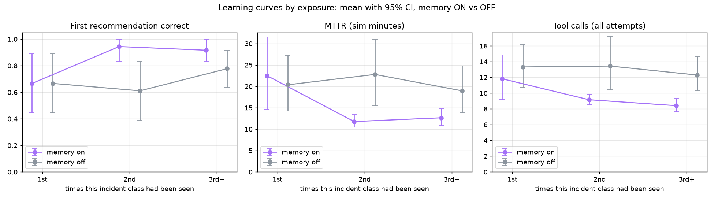
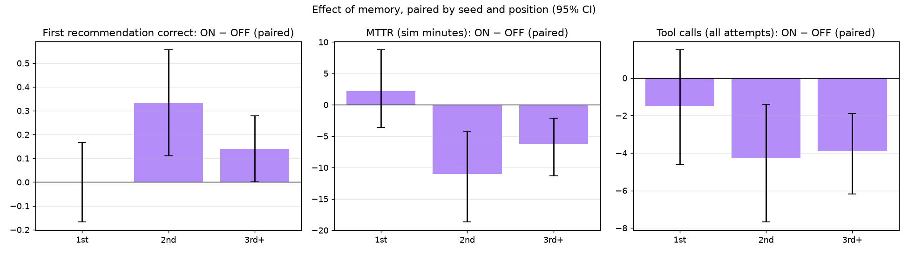
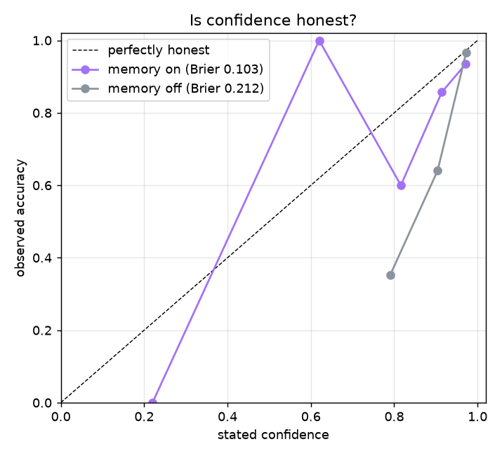

# MemoryOps evaluation — 20260929-062025-06ac955

144 incident runs · seeds [1, 2, 3] · memory ON vs OFF, paired (same incidents, same order) · auto-approval · fast-forward clock (35 sim-s per tool call) · git `06ac955` · model `openai:gpt-5.4-mini` · 2026-09-29T06:20:25+00:00

> Memory matches in this run were gated without Hindsight's cross-encoder (passthrough reranker): llm_judge ×69 of 72 memory-ON incidents (BUILD_PLAN 6.3b).

## Acceptance targets (BUILD_PLAN 11.5)

| # | Target | Result | Evidence |
|---|---|---|---|
| 1 | Memory ON, 3rd+ exposure: recommendation accuracy higher than OFF (paired 95% CI excludes 0) | ❌ FAIL | +14% [+0%, +28%] (n=36) |
| 2 | Memory ON, 3rd+ exposure: tool calls and MTTR lower than OFF (paired 95% CIs exclude 0) | ✅ PASS | tool calls -3.9 [-6.2, -1.9] (n=36); MTTR -6.3 min [-11.3, -2.1] (n=36) |
| 3 | Memory OFF: no significant trend from 1st to 3rd+ exposure (the gain is memory, not drift) | ✅ PASS | accuracy +11% [-14%, +36%] (n=54); tool_calls -1.0 [-4.6, +2.4] (n=54) |
| 4 | Discrimination: false replays ≤ 1 per 15 probes (memory ON) | ❌ FAIL | 7 / 69 probes (10.1%) |
| 5 | Retrieval: recall@1 ≥ 0.8 when a same-class prior exists | ❌ FAIL | 65% [51%–76%] (n=54) |
| 6 | No harm: on textbook incidents memory does not lower accuracy (paired ON − OFF not significantly below 0) | ✅ PASS | +0% [-6%, +6%] (n=48) |

If a target is missed, the fix belongs in the agent or memory design — never in the metric.

## By family

### Textbook incidents (the fix follows from the evidence) — memory must not hurt

n = 48 incidents per condition.

| Exposure | Accuracy ON | Accuracy OFF | ON − OFF | Safe ON | Safe OFF | Tool calls ON | Tool calls OFF |
|---|---|---|---|---|---|---|---|
| 1st | 92% [75%–100%] n=12 | 100% [100%–100%] n=12 | -8% [-25%, +0%] (n=12) | 92% [75%–100%] n=12 | 100% [100%–100%] n=12 | 10.0 [8.2–12.8] n=12 | 9.8 [9.5–10.0] n=12 |
| 2nd | 100% [100%–100%] n=12 | 92% [75%–100%] n=12 | +8% [+0%, +25%] (n=12) | 100% [100%–100%] n=12 | 100% [100%–100%] n=12 | 8.7 [8.1–9.2] n=12 | 9.6 [9.3–9.8] n=12 |
| 3rd+ | 100% [100%–100%] n=24 | 100% [100%–100%] n=24 | +0% [+0%, +0%] (n=24) | 100% [100%–100%] n=24 | 100% [100%–100%] n=24 | 7.7 [7.1–8.3] n=24 | 9.2 [8.9–9.6] n=24 |

All exposures, paired ON − OFF: accuracy +0% [-6%, +6%] (n=48); tool calls -0.9 [-1.6, -0.1] (n=48); MTTR -0.4 min [-2.3, +2.0] (n=48).

### Site-knowledge incidents (the fix is known only from a past resolution)

n = 24 incidents per condition.

| Exposure | Accuracy ON | Accuracy OFF | ON − OFF | Safe ON | Safe OFF | Tool calls ON | Tool calls OFF |
|---|---|---|---|---|---|---|---|
| 1st | 17% [0%–50%] n=6 | 0% [0%–0%] n=6 | +17% [+0%, +50%] (n=6) | 50% [17%–83%] n=6 | 17% [0%–50%] n=6 | 15.5 [9.8–21.3] n=6 | 20.5 [16.0–25.0] n=6 |
| 2nd | 83% [50%–100%] n=6 | 0% [0%–0%] n=6 | +83% [+50%, +100%] (n=6) | 83% [50%–100%] n=6 | 33% [0%–67%] n=6 | 10.2 [9.2–11.7] n=6 | 21.2 [13.2–27.8] n=6 |
| 3rd+ | 75% [50%–100%] n=12 | 33% [8%–58%] n=12 | +42% [+8%, +75%] (n=12) | 83% [58%–100%] n=12 | 42% [17%–67%] n=12 | 9.8 [8.2–11.8] n=12 | 18.4 [13.6–23.2] n=12 |

All exposures, paired ON − OFF: accuracy +46% [+25%, +67%] (n=24); tool calls -8.3 [-12.0, -4.7] (n=24); MTTR -15.3 min [-23.6, -7.1] (n=24).

The agent asked memory mid-investigation in 71 of 72 memory-ON incidents (1.12 calls per incident).

## Learning by exposure (all incidents)

Mean [95% bootstrap CI]; ON − OFF is paired by (seed, position).

**First recommendation correct**

| Exposure | Memory ON | Memory OFF | ON − OFF (paired) |
|---|---|---|---|
| 1st | 67% [44%–89%] n=18 | 67% [44%–89%] n=18 | +0% [-17%, +17%] (n=18) |
| 2nd | 94% [83%–100%] n=18 | 61% [39%–83%] n=18 | +33% [+11%, +56%] (n=18) |
| 3rd+ | 92% [83%–100%] n=36 | 78% [64%–92%] n=36 | +14% [+0%, +28%] (n=36) |

**Safe (right fix, or handed to a human)**

| Exposure | Memory ON | Memory OFF | ON − OFF (paired) |
|---|---|---|---|
| 1st | 78% [56%–94%] n=18 | 72% [50%–89%] n=18 | +6% [-11%, +22%] (n=18) |
| 2nd | 94% [83%–100%] n=18 | 78% [56%–94%] n=18 | +17% [+0%, +33%] (n=18) |
| 3rd+ | 94% [86%–100%] n=36 | 81% [67%–92%] n=36 | +14% [+0%, +28%] (n=36) |

**MTTR (sim minutes)**

| Exposure | Memory ON | Memory OFF | ON − OFF (paired) |
|---|---|---|---|
| 1st | 22.5 [14.7–31.5] n=18 | 20.4 [14.3–27.3] n=18 | +2.1 min [-3.6, +8.7] (n=18) |
| 2nd | 11.8 [10.5–13.4] n=18 | 22.8 [15.4–31.0] n=18 | -11.0 min [-18.6, -4.2] (n=18) |
| 3rd+ | 12.7 [10.9–14.7] n=36 | 19.0 [13.9–24.8] n=36 | -6.3 min [-11.3, -2.1] (n=36) |

**Tool calls (all attempts)**

| Exposure | Memory ON | Memory OFF | ON − OFF (paired) |
|---|---|---|---|
| 1st | 11.8 [9.2–14.8] n=18 | 13.3 [10.8–16.2] n=18 | -1.5 [-4.6, +1.5] (n=18) |
| 2nd | 9.2 [8.6–9.9] n=18 | 13.4 [10.4–17.2] n=18 | -4.3 [-7.7, -1.4] (n=18) |
| 3rd+ | 8.4 [7.7–9.3] n=36 | 12.3 [10.3–14.7] n=36 | -3.9 [-6.2, -1.9] (n=36) |

**Stated confidence**

| Exposure | Memory ON | Memory OFF | ON − OFF (paired) |
|---|---|---|---|
| 1st | 89% [84%–93%] n=18 | 91% [88%–94%] n=18 | -2% [-6%, +2%] (n=18) |
| 2nd | 90% [82%–96%] n=18 | 91% [88%–95%] n=18 | -1% [-9%, +4%] (n=18) |
| 3rd+ | 95% [93%–96%] n=36 | 90% [88%–93%] n=36 | +5% [+2%, +8%] (n=36) |





### What drives MTTR

| Exposure | Condition | Attempts (mean) | Wrong first fix | Escalated | n |
|---|---|---|---|---|---|
| 1st | memory_on | 1.22 | 6 | 5 | 18 |
| 1st | memory_off | 1.28 | 6 | 3 | 18 |
| 2nd | memory_on | 1.06 | 1 | 0 | 18 |
| 2nd | memory_off | 1.28 | 7 | 5 | 18 |
| 3rd+ | memory_on | 1.06 | 3 | 1 | 36 |
| 3rd+ | memory_off | 1.31 | 8 | 5 | 36 |

## Per class

| Class | Exposure | Accuracy ON | Accuracy OFF | MTTR ON | MTTR OFF | Tools ON | Tools OFF |
|---|---|---|---|---|---|---|---|
| config regression | 1st | 67% [0%–100%] n=3 | 100% [100%–100%] n=3 | 24.6 [11.2–51.3] n=3 | 10.7 [9.6–11.8] n=3 | 14.3 [9.0–24.0] n=3 | 9.3 [9.0–10.0] n=3 |
| config regression | 2nd | 100% [100%–100%] n=3 | 100% [100%–100%] n=3 | 9.8 [8.9–11.1] n=3 | 11.2 [10.5–11.5] n=3 | 7.7 [7.0–9.0] n=3 | 10.0 [10.0–10.0] n=3 |
| config regression | 3rd+ | 100% [100%–100%] n=6 | 100% [100%–100%] n=6 | 9.9 [9.4–10.5] n=6 | 11.0 [10.6–11.3] n=6 | 7.7 [6.8–8.5] n=6 | 9.7 [9.3–10.0] n=6 |
| sensor drift | 1st | 100% [100%–100%] n=3 | 100% [100%–100%] n=3 | 11.5 [10.8–12.3] n=3 | 12.1 [11.5–12.5] n=3 | 9.0 [7.0–10.0] n=3 | 10.0 [10.0–10.0] n=3 |
| sensor drift | 2nd | 100% [100%–100%] n=3 | 67% [0%–100%] n=3 | 11.8 [11.2–12.5] n=3 | 21.4 [12.2–39.7] n=3 | 9.0 [8.0–10.0] n=3 | 10.0 [10.0–10.0] n=3 |
| sensor drift | 3rd+ | 100% [100%–100%] n=6 | 100% [100%–100%] n=6 | 11.4 [10.4–12.3] n=6 | 12.3 [11.7–12.9] n=6 | 7.8 [6.8–9.0] n=6 | 9.8 [9.5–10.0] n=6 |
| network failure | 1st | 100% [100%–100%] n=3 | 100% [100%–100%] n=3 | 8.6 [8.4–9.0] n=3 | 9.0 [9.0–9.0] n=3 | 9.3 [9.0–10.0] n=3 | 10.0 [10.0–10.0] n=3 |
| network failure | 2nd | 100% [100%–100%] n=3 | 100% [100%–100%] n=3 | 8.8 [8.4–9.0] n=3 | 8.6 [8.4–9.0] n=3 | 9.7 [9.0–10.0] n=3 | 9.3 [9.0–10.0] n=3 |
| network failure | 3rd+ | 100% [100%–100%] n=6 | 100% [100%–100%] n=6 | 8.3 [7.6–8.9] n=6 | 8.5 [7.9–8.9] n=6 | 8.8 [7.7–9.8] n=6 | 9.2 [8.2–9.8] n=6 |
| resource exhaustion | 1st | 100% [100%–100%] n=3 | 100% [100%–100%] n=3 | 10.8 [10.2–11.2] n=3 | 12.2 [12.0–12.5] n=3 | 7.3 [7.0–8.0] n=3 | 9.7 [9.0–10.0] n=3 |
| resource exhaustion | 2nd | 100% [100%–100%] n=3 | 100% [100%–100%] n=3 | 10.6 [10.0–11.2] n=3 | 10.9 [10.6–11.1] n=3 | 8.3 [8.0–9.0] n=3 | 9.0 [9.0–9.0] n=3 |
| resource exhaustion | 3rd+ | 100% [100%–100%] n=6 | 100% [100%–100%] n=6 | 9.9 [9.6–10.3] n=6 | 11.0 [10.7–11.2] n=6 | 6.5 [5.8–7.0] n=6 | 8.3 [8.0–8.7] n=6 |
| vision link dropout | 1st | 33% [0%–100%] n=3 | 0% [0%–0%] n=3 | 34.3 [10.6–47.4] n=3 | 46.4 [38.2–53.7] n=3 | 12.7 [9.0–19.0] n=3 | 16.3 [10.0–20.0] n=3 |
| vision link dropout | 2nd | 100% [100%–100%] n=3 | 0% [0%–0%] n=3 | 12.9 [11.2–14.7] n=3 | 34.0 [20.0–41.1] n=3 | 9.7 [9.0–10.0] n=3 | 13.0 [9.0–20.0] n=3 |
| vision link dropout | 3rd+ | 67% [33%–100%] n=6 | 50% [17%–83%] n=6 | 19.0 [13.5–27.2] n=6 | 20.4 [14.6–28.6] n=6 | 10.5 [9.2–12.8] n=6 | 12.0 [9.0–15.7] n=6 |
| servo tuning drift | 1st | 0% [0%–0%] n=3 | 0% [0%–0%] n=3 | 45.1 [31.7–58.1] n=3 | 31.8 [25.8–36.9] n=3 | 18.3 [6.0–25.0] n=3 | 24.7 [19.0–28.0] n=3 |
| servo tuning drift | 2nd | 67% [0%–100%] n=3 | 0% [0%–0%] n=3 | 16.8 [13.1–22.5] n=3 | 50.7 [34.7–59.8] n=3 | 10.7 [9.0–14.0] n=3 | 29.3 [29.0–30.0] n=3 |
| servo tuning drift | 3rd+ | 83% [50%–100%] n=6 | 17% [0%–50%] n=6 | 17.5 [14.5–22.0] n=6 | 50.5 [34.3–63.1] n=6 | 9.2 [7.2–12.8] n=6 | 24.8 [18.3–28.5] n=6 |

## Transfer to held-out machines

First exposure on M4–M5 after two exposures on M1–M3 — accuracy: memory ON 94% [74%–99%] (n=18), memory OFF 67% [44%–84%] (n=18). A same-class prior was among the matches in 10 of 18 (mean rank 1.0).

## Discrimination

- **memory_on**: 7 false replays in 69 probes (incidents where memory already held another class; rate 10% [5%–19%] (n=69)); sensor drift right after a config regression: 0 / 12; memory-induced (the wrong fix is a matched other-class incident's fix): 4 / 69.
- **memory_off**: 16 false replays in 69 probes (incidents where memory already held another class; rate 23% [15%–34%] (n=69)); sensor drift right after a config regression: 0 / 12; memory-induced (the wrong fix is a matched other-class incident's fix): 0 / 69.

`false_replay` (target 4, as specified) counts any other class's fix, so it also counts wrong guesses made without memory — see the memory OFF row. *Memory-induced* is the narrower diagnostic of memory misleading the agent; it does not change target 4's verdict.

## Retrieval quality (memory ON)

- recall@1 when a same-class prior exists: 65% [51%–76%] (n=54)
- gate precision (matches of the same class): 64% [53%–74%] (n=75)
- precision of matches labelled *strong*: 65% [54%–75%] (n=74)
- incidents with no same-class prior that still got a match: 7 / 18 (mean matches per incident 1.04)

## Is confidence honest?

**memory_on** — Brier score 0.103 (0 = perfect, 0.25 = always saying 50%)

| Stated confidence | n | Mean stated | Observed accuracy |
|---|---|---|---|
| 0%–50% | 1 | 22% | 0% |
| 50%–70% | 1 | 62% | 100% |
| 70%–85% | 10 | 82% | 60% |
| 85%–95% | 14 | 91% | 86% |
| 95%–100% | 46 | 97% | 93% |

**memory_off** — Brier score 0.212 (0 = perfect, 0.25 = always saying 50%)

| Stated confidence | n | Mean stated | Observed accuracy |
|---|---|---|---|
| 0%–50% | 0 | — | — |
| 50%–70% | 0 | — | — |
| 70%–85% | 17 | 79% | 35% |
| 85%–95% | 25 | 90% | 64% |
| 95%–100% | 30 | 97% | 97% |



## Cost

| Condition | LLM tokens / incident | LLM $ / incident | Hindsight billed tokens (est.) | Hindsight $ (est.) | Runbook refreshes | Real s / incident |
|---|---|---|---|---|---|---|
| memory_on | 25,047 | $0.0166 | 10,832 | $0.0266 | 0.26 | 23.4 |
| memory_off | 16,046 | $0.0142 | 594 | $0.0157 | 0.19 | 18.4 |

Total: 144 incidents, 2,958,722 LLM tokens, $2.22 LLM + $3.04 Hindsight (estimated; the Hindsight billing page is authoritative).

## Where it fails

| Class | Condition | Seed | # | Incident | Machine | Seen | Recommended | Top match | Trace |
|---|---|---|---|---|---|---|---|---|---|
| config regression | memory_on | 1 | 4 | INC-004 | M3 | 1 | RESTART_MACHINE ⚠ false replay | INC-003 (servo tuning drift, 0.86) | [trace](https://us.cloud.langfuse.com/project/cmulf4hha07ngad0cidlo44fp/traces/27e269572d8495969ceaa2943b2608ed) |
| sensor drift | memory_off | 2 | 12 | INC-012 | M1 | 2 | ESCALATE_HUMAN | — | [trace](https://us.cloud.langfuse.com/project/cmulf4hha07ngad0cidlo44fp/traces/c11b4798858c0addbf9d4b36a8bcf439) |
| servo tuning drift | memory_off | 1 | 3 | INC-003 | M2 | 1 | RECALIBRATE_SENSOR ⚠ false replay | — | [trace](https://us.cloud.langfuse.com/project/cmulf4hha07ngad0cidlo44fp/traces/5dfc0f8ec73a35161da4838a64a99c49) |
| servo tuning drift | memory_off | 1 | 11 | INC-011 | M2 | 2 | RECALIBRATE_SENSOR ⚠ false replay | — | [trace](https://us.cloud.langfuse.com/project/cmulf4hha07ngad0cidlo44fp/traces/09753d14e6fe4153b5d45e62bb9e4006) |
| servo tuning drift | memory_off | 1 | 14 | INC-014 | M5 | 3 | RECALIBRATE_SENSOR ⚠ false replay | — | [trace](https://us.cloud.langfuse.com/project/cmulf4hha07ngad0cidlo44fp/traces/4ff03fec3b7dff321d1eacdfc0a79576) |
| servo tuning drift | memory_off | 1 | 21 | INC-021 | M4 | 4 | RECALIBRATE_SENSOR ⚠ false replay | — | [trace](https://us.cloud.langfuse.com/project/cmulf4hha07ngad0cidlo44fp/traces/6a178e151bd2863a7d74049d64bdbfc2) |
| servo tuning drift | memory_off | 2 | 3 | INC-003 | M1 | 1 | RECALIBRATE_SENSOR ⚠ false replay | — | [trace](https://us.cloud.langfuse.com/project/cmulf4hha07ngad0cidlo44fp/traces/9cfea2528e291a8f1c177929285a0ecf) |
| servo tuning drift | memory_off | 2 | 9 | INC-009 | M1 | 2 | RECALIBRATE_SENSOR ⚠ false replay | — | [trace](https://us.cloud.langfuse.com/project/cmulf4hha07ngad0cidlo44fp/traces/46fc9553a3ba69af7d56c8de29ca23a2) |
| servo tuning drift | memory_off | 2 | 16 | INC-016 | M5 | 3 | RECALIBRATE_SENSOR ⚠ false replay | — | [trace](https://us.cloud.langfuse.com/project/cmulf4hha07ngad0cidlo44fp/traces/17dec535f5d9698085cc4b5321296ee3) |
| servo tuning drift | memory_off | 2 | 23 | INC-023 | M4 | 4 | RECALIBRATE_SENSOR ⚠ false replay | — | [trace](https://us.cloud.langfuse.com/project/cmulf4hha07ngad0cidlo44fp/traces/2a4dbe2063654c2baf99f9527fd076ab) |
| servo tuning drift | memory_off | 3 | 4 | INC-004 | M1 | 1 | CLEAR_CACHE ⚠ false replay | — | [trace](https://us.cloud.langfuse.com/project/cmulf4hha07ngad0cidlo44fp/traces/4d95c6fd66b3d8d41497c543991e9791) |
| servo tuning drift | memory_off | 3 | 8 | INC-008 | M1 | 2 | RECALIBRATE_SENSOR ⚠ false replay | — | [trace](https://us.cloud.langfuse.com/project/cmulf4hha07ngad0cidlo44fp/traces/e87365c2597e8d22732500621fd538a1) |
| servo tuning drift | memory_off | 3 | 17 | INC-017 | M4 | 3 | ROLLBACK_CONFIG ⚠ false replay | — | [trace](https://us.cloud.langfuse.com/project/cmulf4hha07ngad0cidlo44fp/traces/f065b076e0e70793f7df33ca6ceda97f) |
| servo tuning drift | memory_on | 1 | 3 | INC-003 | M2 | 1 | RECALIBRATE_SENSOR ⚠ false replay | — | [trace](https://us.cloud.langfuse.com/project/cmulf4hha07ngad0cidlo44fp/traces/a293403f77715bdfb29abf25c53e697c) |
| servo tuning drift | memory_on | 2 | 3 | INC-003 | M1 | 1 | ESCALATE_HUMAN | — | [trace](https://us.cloud.langfuse.com/project/cmulf4hha07ngad0cidlo44fp/traces/b356c0f1873bc995ecb68c62ae8791ec) |
| servo tuning drift | memory_on | 2 | 23 | INC-023 | M4 | 4 | ROLLBACK_CONFIG ⚠ false replay | INC-001 (config regression, 0.96) | [trace](https://us.cloud.langfuse.com/project/cmulf4hha07ngad0cidlo44fp/traces/5ecca1028be92f5ab3fd17e2fefe52cf) |
| servo tuning drift | memory_on | 3 | 4 | INC-004 | M1 | 1 | CLEAR_CACHE ⚠ false replay | INC-001 (config regression, 0.93) | [trace](https://us.cloud.langfuse.com/project/cmulf4hha07ngad0cidlo44fp/traces/52b1156599a219193a8d0755e6524b19) |
| servo tuning drift | memory_on | 3 | 8 | INC-008 | M1 | 2 | RESTART_GATEWAY ⚠ false replay | — | [trace](https://us.cloud.langfuse.com/project/cmulf4hha07ngad0cidlo44fp/traces/a31a6a4f01d176cd8573a0c78adba169) |
| vision link dropout | memory_off | 1 | 1 | INC-001 | M3 | 1 | ESCALATE_HUMAN | — | [trace](https://us.cloud.langfuse.com/project/cmulf4hha07ngad0cidlo44fp/traces/91e68f720f6e4132fab72b446fd24c41) |
| vision link dropout | memory_off | 1 | 10 | INC-010 | M3 | 2 | RESTART_MACHINE ⚠ false replay | — | [trace](https://us.cloud.langfuse.com/project/cmulf4hha07ngad0cidlo44fp/traces/a62d48f2e7d40117a8fe5ffc7eb17e5b) |
| vision link dropout | memory_off | 1 | 13 | INC-013 | M4 | 3 | RESTART_MACHINE ⚠ false replay | — | [trace](https://us.cloud.langfuse.com/project/cmulf4hha07ngad0cidlo44fp/traces/8e77b7dceb79cc61c505171c76eaaaf7) |
| vision link dropout | memory_off | 2 | 6 | INC-006 | M3 | 1 | RECALIBRATE_SENSOR ⚠ false replay | — | [trace](https://us.cloud.langfuse.com/project/cmulf4hha07ngad0cidlo44fp/traces/a8c252eda9d1743f457b8a614e714700) |
| vision link dropout | memory_off | 2 | 8 | INC-008 | M3 | 2 | ESCALATE_HUMAN | — | [trace](https://us.cloud.langfuse.com/project/cmulf4hha07ngad0cidlo44fp/traces/02fd2eccd3a021bd74ebc4612eaeea98) |
| vision link dropout | memory_off | 2 | 13 | INC-013 | M4 | 3 | RESTART_MACHINE ⚠ false replay | — | [trace](https://us.cloud.langfuse.com/project/cmulf4hha07ngad0cidlo44fp/traces/e8482f89225416146386239ef47b6819) |
| vision link dropout | memory_off | 3 | 5 | INC-005 | M2 | 1 | RESTART_MACHINE ⚠ false replay | — | [trace](https://us.cloud.langfuse.com/project/cmulf4hha07ngad0cidlo44fp/traces/a5a461bd2889a550d2a618c79ea47b94) |
| vision link dropout | memory_off | 3 | 12 | INC-012 | M1 | 2 | ESCALATE_HUMAN | — | [trace](https://us.cloud.langfuse.com/project/cmulf4hha07ngad0cidlo44fp/traces/3e9057a70b1c6902945840573db580bf) |
| vision link dropout | memory_off | 3 | 18 | INC-018 | M5 | 3 | ESCALATE_HUMAN | — | [trace](https://us.cloud.langfuse.com/project/cmulf4hha07ngad0cidlo44fp/traces/f0bb1b22569a31b49cabf2e7b65e5055) |
| vision link dropout | memory_on | 2 | 6 | INC-006 | M3 | 1 | RECALIBRATE_SENSOR ⚠ false replay | INC-002 (sensor drift, 0.97) | [trace](https://us.cloud.langfuse.com/project/cmulf4hha07ngad0cidlo44fp/traces/3937c7cbd2904c16373d525daa0c490d) |
| vision link dropout | memory_on | 2 | 20 | INC-020 | M5 | 4 | CLEAR_CACHE ⚠ false replay | INC-004 (resource exhaustion, 0.93) | [trace](https://us.cloud.langfuse.com/project/cmulf4hha07ngad0cidlo44fp/traces/5bd657bc30f25f31160e6b9e7dc5f996) |
| vision link dropout | memory_on | 3 | 5 | INC-005 | M2 | 1 | ESCALATE_HUMAN | — | [trace](https://us.cloud.langfuse.com/project/cmulf4hha07ngad0cidlo44fp/traces/eabfb90abaa3a64f319f7e607b87147c) |
| vision link dropout | memory_on | 3 | 18 | INC-018 | M5 | 3 | ESCALATE_HUMAN | INC-006 (network failure, 0.92) | [trace](https://us.cloud.langfuse.com/project/cmulf4hha07ngad0cidlo44fp/traces/156b62142e333833af8f8cad2e822eab) |

## Per-seed accuracy

Incidents within a seed share a world and a memory bank, so they are not independent; pooled CIs above assume they are. Per-seed means show how much seeds differ.

| Condition | seed 1 | seed 2 | seed 3 |
|---|---|---|---|
| memory_on | 92% | 83% | 83% |
| memory_off | 71% | 67% | 75% |

## Run metadata

```json
{
  "run_id": "20260929-062025-06ac955",
  "started_at": "2026-09-29T06:20:25+00:00",
  "git_sha": "06ac955",
  "git_dirty": false,
  "seeds": [
    1,
    2,
    3
  ],
  "incidents_per_unit": 24,
  "battery": "full",
  "conditions": [
    "memory_on",
    "memory_off"
  ],
  "parallel": 3,
  "tool_call_sim_s": 35,
  "gap_between_incidents_sim_s": [
    7200,
    43200
  ],
  "llm_primary": "openai:gpt-5.4-mini",
  "llm_fallback": "groq:openai/gpt-oss-120b",
  "llm_reasoning_effort": "none",
  "llm_temperature": 0,
  "llm_seed": 42,
  "max_tool_calls": 10,
  "max_attempts": 3,
  "verify_window_sim_s": 180,
  "escalation_penalty_sim_s": 1800,
  "memory_match_rel_rerank": 0.15,
  "memory_match_min_rerank": 0.05,
  "pricing": {
    "llm": "OpenAI: developers.openai.com/api/docs/pricing, Standard tier, fetched 2026-09-28. Groq: account is on the free plan, so calls cost $0 (tokens still counted).",
    "hindsight": "Hindsight Cloud billing page, Operation rates, read 2026-09-29."
  },
  "python": "3.11.15",
  "packages": {
    "openai": "3.19.2",
    "hindsight-client": "0.10.1",
    "langgraph": "1.2.12",
    "langfuse": "4.15.6",
    "fastapi": "0.141.1"
  },
  "finished_at": "2026-09-29T06:40:50+00:00",
  "wall_clock_s": 1225,
  "failed_units": [],
  "eval_spend_usd": 5.2635,
  "units_completed": 6
}
```
